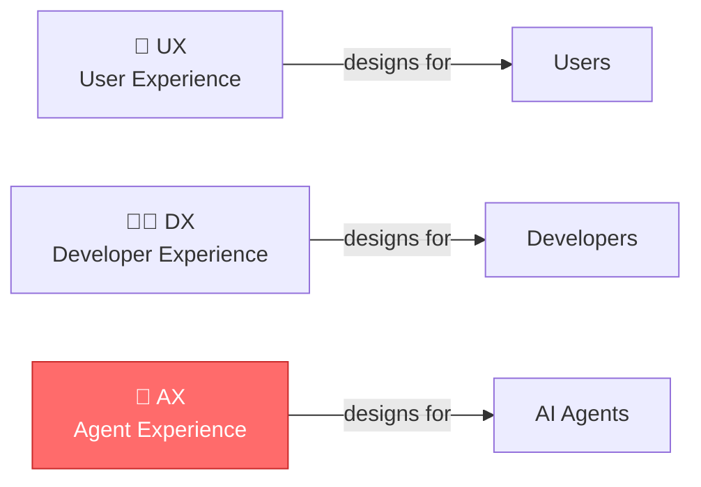
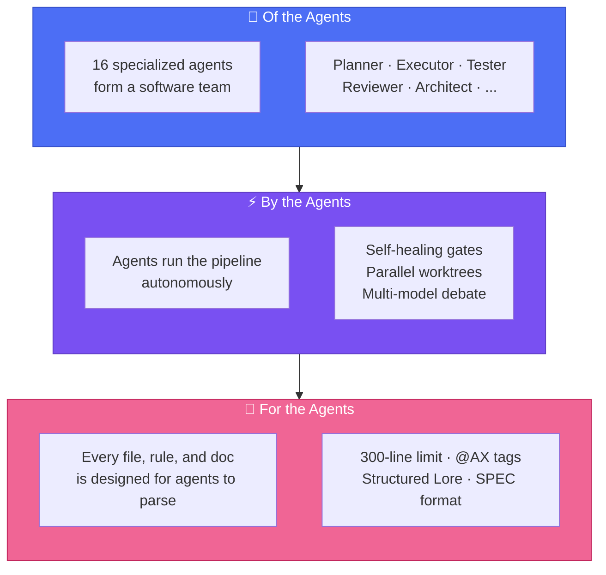
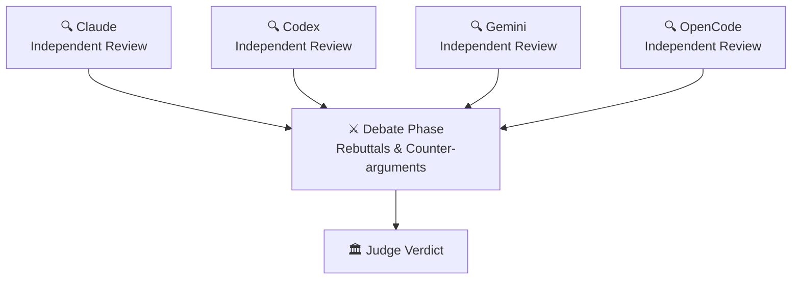
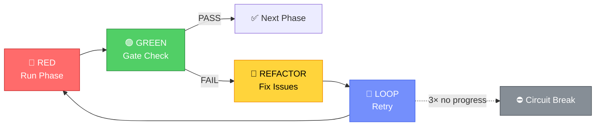
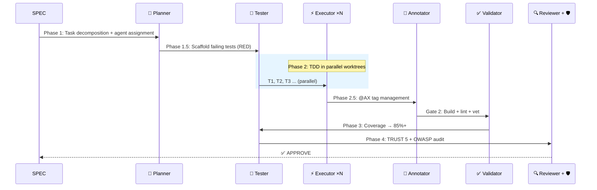
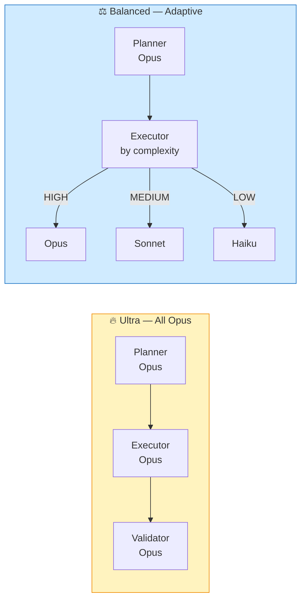
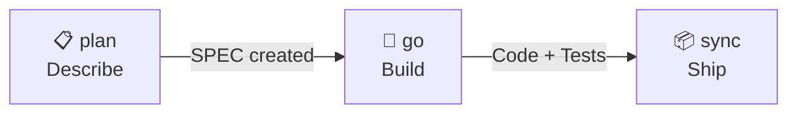

<div align="center">

# 🐙 Autopus-ADK

### A harness *of* the agents, *by* the agents, *for* the agents.

**16 agents. 40 skills. One config. Every platform.**

[](https://github.com/Insajin/autopus-adk/stargazers)
[](https://opensource.org/licenses/MIT)
[](https://golang.org)
[](#-one-config-four-platforms)
[](#-16-specialized-agents)
[](#-all-commands)

```bash
# macOS / Linux
curl -sSfL https://raw.githubusercontent.com/Insajin/autopus-adk/main/install.sh | sh

# Windows (CMD or PowerShell)
powershell -c "irm https://raw.githubusercontent.com/Insajin/autopus-adk/main/install.ps1 | iex"
```

[Why Autopus](#-the-problem) · [**Core Workflow**](#-the-workflow-three-commands-to-ship) · [Features](#-what-makes-autopus-different) · [Pipeline](#-the-pipeline) · [Security](#-security) · [Docs](#-all-commands)

[🇰🇷 한국어](docs/README.ko.md)

</div>

---

## 🎬 See It In Action

<p align="center"></p>

```bash
# Brainstorm with 3 AI models debating each other
/auto idea "Add OAuth2 with Google and GitHub providers" --multi --ultrathink

# One command does the rest — plan, build with 16 agents, ship with docs
/auto dev "Add OAuth2 with Google and GitHub providers"
```

Or if you prefer step-by-step control:

```bash
/auto plan "Add OAuth2 with Google and GitHub providers" --auto --multi --ultrathink
/auto go SPEC-AUTH-001 --auto --loop --team
/auto sync SPEC-AUTH-001
```

```
🐙 Pipeline ─────────────────────────────────────────────
  ✓ Phase 1:   Planning         planner decomposed 5 tasks
  ✓ Phase 1.5: Test Scaffold    12 failing tests created (RED)
  ✓ Phase 2:   Implementation   3 executors in parallel worktrees
  ✓ Phase 2.5: Annotation       @AX tags applied to 8 files
  ✓ Phase 3:   Testing          coverage: 62% → 91%
  ✓ Phase 4:   Review           TRUST 5: APPROVE | Security: PASS
  ───────────────────────────────────────────────────────
  ✅ 5/5 tasks │ 91% coverage │ 0 security issues │ 4m 32s
```

> 💡 One slash command. Production-ready code with tests, security audit, documentation, and decision history.

---

## 😤 The Problem

You're using AI coding tools. They're powerful. But...

- 🔄 **Platform lock-in** — Switch from Claude to Codex? Rewrite all your rules and prompts from scratch.
- 🎲 **Hope-driven development** — "Add auth" → AI writes code, skips tests, ignores security, forgets docs. *Maybe* it works.
- 🧠 **Amnesia** — Next session, the AI forgets every decision. "Why did we use this pattern?" → silence.
- 👤 **Solo agent** — One model, one context, one shot. Multi-file refactoring? Good luck.

---

## 🧠 The Philosophy: AX — Agent Experience

> **AX** is not "AI Transformation." AX is **Agent Experience** — how AI agents perceive, navigate, and operate within your codebase. Just as UX designs for users and DX designs for developers, **AX designs for agents.**



Most AI coding tools are designed around a simple model: **you prompt, it responds.**

Autopus starts from a different question: *What if the agent is the primary audience of your project's documentation?*

Think about onboarding a new engineer. You wouldn't hand them a blank editor and say "build the auth system." You'd give them:
- An architecture overview so they understand the system
- Coding conventions so their code fits in
- Decision history so they don't repeat past mistakes
- A review process so mistakes get caught before shipping

**AI agents need the same things.** The difference is that every session is their first day.

Autopus is a **harness** — a structured environment that gives agents the context, constraints, and workflows they need to produce code that a senior engineer would approve. Not through hope. Through design.

### Of the agents. By the agents. For the agents.



| Principle | What It Means |
|-----------|--------------|
| **Of the Agents** | 16 specialized agents form a real engineering team — planner, executor, tester, reviewer, security auditor, and more. Not one chatbot. A team. |
| **By the Agents** | Agents run the pipeline autonomously — self-healing quality gates, parallel worktrees, multi-model debate. Humans set the goal; agents handle the rest. |
| **For the Agents** | Every file, rule, and document is designed to be parsed by agents, not just read by humans. Structure over prose. That's AX. |
| **Every Session is Day One** | Agents lose all context between sessions. The harness provides institutional memory — architecture, decisions, conventions — so they start informed, not blank. |

> 🐙 **Autopus doesn't make agents smarter. It makes them informed. That's AX.**

---

## 🔥 What Makes Autopus Different

### 📏 Code That Agents Can Actually Read

Most codebases aren't written for AI. A 1,200-line file overwhelms context windows. Tangled responsibilities confuse intent. Autopus enforces a **hard 300-line limit** on every source file — not for aesthetics, but because **agents work better when each file has one job and fits in one read.**

```
❌ Traditional:
   service.go (1,200 lines) → Agent loses context halfway through

✅ Autopus:
   service.go       (180 lines)  Handler logic
   service_auth.go  (120 lines)  Auth middleware
   service_repo.go  (150 lines)  Data access
   → Every file fits in one context window. Every file has one job.
```

This isn't just about file size. The entire harness is **agent-readable by design:**

| Layer | How It's Agent-Friendly |
|-------|------------------------|
| **Rules** | Structured markdown with IMPORTANT markers — agents parse, not skim |
| **Skills** | YAML frontmatter with triggers — agents auto-activate the right skill |
| **Docs** | Tables over paragraphs, checklists over prose — parseable, not readable |
| **Code** | ≤ 300 lines, single responsibility, split by concern — fits in one context |

> 🐙 **Human-readable is a bonus. Agent-readable is the requirement.**

### 🤖 AI Agents That Form a Team, Not a Chatbot

Autopus doesn't give you one AI assistant — it gives you a **software engineering team of 16 specialized agents** with defined roles, quality gates, and retry logic.

```
🧠 Planner        →  Decomposes requirements into tasks
⚡ Executor ×N    →  Implements code in parallel worktrees
🧪 Tester         →  Writes tests BEFORE code (TDD enforced)
✅ Validator       →  Checks build, lint, vet
🔍 Reviewer       →  TRUST 5 code review
🛡️ Security       →  OWASP Top 10 audit
📝 Annotator      →  Documents code with @AX tags
🏗️ Architect      →  System design decisions
🔬 Deep Worker    →  Long-running autonomous exploration + implementation
... and 7 more
```

### ⚔️ AI Models That Debate Each Other

Not one model reviewing your code — **multiple models arguing about it.**

```bash
auto orchestra review --strategy debate
```

Claude, Codex, Gemini, and OpenCode independently review your code, then **debate each other's findings** in a structured 2-phase argument. A judge renders the final verdict.



4 strategies: **Consensus** · **Debate** · **Pipeline** · **Fastest**

### 🔁 Self-Healing Pipeline (RALF Loop)

Quality gates don't just fail — they **fix themselves and retry.**



```bash
/auto go SPEC-AUTH-001 --auto --loop
```

```
🐙 RALF [Gate 2] ──────────────────
  Iteration: 1/5 │ Issues: 3
  → spawning executor to fix golangci-lint warnings...

🐙 RALF [Gate 2] ──────────────────
  Iteration: 2/5 │ Issues: 3 → 0
  Status: PASS ✅
```

**RALF = RED → GREEN → REFACTOR → LOOP** — TDD principles applied to the pipeline itself. Built-in circuit breaker prevents infinite loops.

### 🌳 Parallel Agents in Isolated Worktrees

Multiple executors work **simultaneously** — each in its own git worktree. No conflicts. No corruption.

```
Phase 2: Implementation
  ├── ⚡ Executor 1 (worktree/T1) → pkg/auth/provider.go     ✓
  ├── ⚡ Executor 2 (worktree/T2) → pkg/auth/handler.go      ✓
  └── ⚡ Executor 3 (worktree/T3) → pkg/auth/middleware.go    ✓

Phase 2.1: Merge (task-ID order)
  ✓ T1 merged → T2 merged → T3 merged → working branch
```

File ownership prevents conflicts. GC suppression prevents corruption. Up to **5 concurrent worktrees.**

### 📜 Lore: Your Codebase Never Forgets

Every commit captures the **why**, not just the what. Queryable forever.

```
feat(auth): add OAuth2 provider abstraction

Why: Need Google + GitHub support, extensible for future providers
Decision: Interface-based abstraction over direct SDK usage
Alternatives: Direct SDK calls (rejected: too coupled)
Ref: SPEC-AUTH-001

🐙 Autopus <noreply@autopus.co>
```

9 structured trailers. Query with `auto lore query "why interface?"`. Stale decisions auto-detected after 90 days.

### 🧪 Autonomous Experiment Loop

Let AI iterate autonomously — measure, keep or discard, repeat.

```bash
/auto experiment --metric "go test -bench=BenchmarkProcess" --direction lower --max-iter 5
```

```
🐙 Experiment ───────────────────────
  Iter 1: baseline  │ 1200 ns/op
  Iter 2: optimize  │  850 ns/op  ✓ keep (29% improvement)
  Iter 3: refactor  │  900 ns/op  ✗ discard (regression)
  Iter 4: cache     │  620 ns/op  ✓ keep (27% improvement)
  ─────────────────────────────────────
  Result: 1200 → 620 ns/op (48% improvement)
```

Built-in **circuit breaker** prevents runaway iterations. **Simplicity scoring** penalizes over-complex solutions. Each iteration is a git commit — easy to review or revert.

> ⚠️ **Status: Experimental** — CLI commands (`auto experiment`) are available but skill-level integration is in progress. Core iteration loop works; full pipeline integration is coming.

### 🧠 Pipeline That Learns From Failures

Autopus pipelines don't just fail — they **remember why** and prevent the same mistake next time.

```
Gate 2 FAIL: golangci-lint — unused variable in pkg/auth/
→ Auto-recorded to .autopus/learnings/pipeline.jsonl
→ Next /auto go: learning injected into executor prompt
→ Same mistake never repeated
```

Every pipeline failure is captured as a structured learning entry. On the next run, relevant learnings are automatically injected into agent prompts — giving your pipeline **institutional memory** across sessions.

### 🏥 Post-Deploy Health Check

Deploy first, verify immediately. `canary` runs build verification, E2E tests, and browser health checks against your live deployment.

```bash
/auto canary                          # Build + E2E + browser auto-verification
/auto canary --url https://myapp.com  # Target a specific deployment URL
/auto canary --watch 5m               # Repeat every 5 minutes
/auto canary --compare                # Compare against previous canary report
```

Generates `canary.md` with full diagnostics — build status, test results, accessibility scores, and screenshot diffs.

### 🔀 Smart Model Routing

Not every task needs Opus. Autopus analyzes message complexity and routes to the right model automatically.

```
Simple query     → Haiku  (fast, cheap)
Code review      → Sonnet (balanced)
Architecture     → Opus   (deep reasoning)
```

No configuration needed — the router evaluates token count, code complexity, and domain signals to pick the optimal model. Override anytime with `--quality ultra`.

### 🔌 Provider Connection Wizard

Setting up AI providers shouldn't require reading docs. `auto connect` walks you through a 3-step guided setup.

```bash
auto connect    # Interactive wizard: detect → configure → verify
```

Detects installed CLI tools, validates API keys, tests connectivity, and writes provider config — all in one command.

### 🤖 ADK Worker — Local Agent Execution

Bridge between Autopus CLI and the Autopus platform. ADK Worker runs A2A + MCP hybrid tasks locally, enabling platform-grade orchestration without cloud dependency.

### 💰 Iteration Budget Management

Workers don't run forever. Each executor gets a tool-call budget — preventing runaway agents while ensuring enough room to complete complex tasks.

### 📦 Context Compression

As pipelines progress through phases, earlier context gets compressed automatically — keeping agent prompts focused and within token limits without losing critical information.

### 🔄 Pipeline That Never Dies

Crash mid-pipeline? Resume exactly where you left off.

```bash
/auto go SPEC-AUTH-001 --continue    # Resume from last checkpoint
```

YAML-based checkpoints save pipeline state after every phase. Stale detection prevents resuming outdated sessions. Combined with `--auto --loop`, you get a **fully resilient autonomous pipeline.**

### 🧪 E2E Scenarios from Your Code

Auto-generate and execute E2E test scenarios — no manual test writing needed.

```bash
auto test run                    # Run all scenarios
auto test run -s init --verbose  # Run a specific scenario
```

Autopus analyzes your codebase (Cobra commands, API routes, frontend pages) and generates typed scenarios with **verification primitives** (`exit_code`, `stdout_contains`, `status_code`, `json_path`, etc.). Incremental sync keeps scenarios up-to-date as code evolves.

### 🌐 Browser Automation — AI Agents That See and Click

AI agents can directly interact with web pages — open URLs, read accessibility trees, click elements, fill forms, and capture screenshots.

```bash
/auto browse --url https://example.com/settings
```

```
- @e1 heading "AI Settings"
- @e2 button "Provider Mode"
- @e3 switch "Auto Fallback" [checked]
- @e7 button "Save"
```

Terminal-aware: automatically selects `cmux browser` (in cmux) or `agent-browser` (fallback). Snapshot → Act → Verify loop — agents see the page as an accessibility tree and interact by reference.

### 📺 Live Agent Dashboard

In `--team` mode, each team member gets its own terminal pane with real-time log streaming.

```
┌─ lead ──────────┬─ builder-1 ───────┐
│ Phase 1: Plan   │ T1: auth.go       │
│ 5 tasks created │ implementing...   │
├─ tester ────────┼─ guardian ────────┤
│ scaffold: 12    │ waiting...        │
│ RED state ✓     │                   │
└─────────────────┴───────────────────┘
```

Works in cmux and tmux. Plain terminals degrade gracefully to log-only output.

### 📚 Auto-Documentation with Context7

Before implementation, Autopus fetches latest library docs automatically — so agents never work with stale API knowledge.

```
Phase 1.8: Doc Fetch
  → Detected: cobra v1.9, testify v1.11
  → Fetched: 2 libraries (6000 tokens)
  → Injected into executor + tester prompts
```

Context7 MCP → WebSearch fallback → skip (never blocks pipeline). Adaptive token budget: 1 lib → 5000 tokens, 5 libs → 2000 tokens each.

### 🔌 Hook-Based Result Collection

Instead of scraping terminal output, Autopus uses each provider's native hook system to collect structured JSON results.

| Provider | Hook Type | How |
|----------|-----------|-----|
| Claude Code | Stop hook | Extracts `last_assistant_message` |
| Gemini CLI | AfterAgent hook | Extracts `prompt_response` |
| OpenCode | Plugin | Extracts `text` field |

Fallback: providers without hooks use ReadScreen + idle detection (SPEC-ORCH-006).

### 🔧 More Power Tools

| Feature | Command | What It Does |
|---------|---------|-------------|
| **Reaction Engine** | `auto react check/apply` | Detects CI failures, analyzes logs, generates fix reports automatically |
| **Meta-Agent Builder** | `auto agent create` / `auto skill create` | Scaffold custom agents and skills from patterns |
| **Hard Gate** | `auto check --gate` | Enforce mandatory pipeline gates (mandatory/advisory modes) |
| **Self-Update** | `auto update --self` | Atomic binary update — GitHub Releases check + SHA256 verification |
| **Cost Tracking** | `auto telemetry cost` | Token-based pipeline cost estimation per model |
| **Issue Reporter** | `auto issue report` | Auto-collect error context, sanitize secrets, create GitHub issues |
| **Signature Map** | `auto setup` | Extract exported API signatures (Go + TypeScript) via AST analysis |
| **Test Runner Detection** | `auto init` | Auto-detect jest, vitest, pytest, cargo test frameworks |

### 🌐 One Config, Four Platforms

```bash
auto init   # auto-detects all installed AI coding CLIs
```

One `autopus.yaml` generates **native configuration** for every detected platform.

| Platform | What Gets Generated |
|----------|-------------------|
| **Claude Code** | `.claude/rules/`, `.claude/skills/`, `.claude/agents/`, `CLAUDE.md` |
| **Codex** | `.codex/`, `AGENTS.md` |
| **Gemini CLI** | `.gemini/`, `GEMINI.md` |
| **OpenCode** | `opencode.json`, plugins |

Same 16 agents. Same 40 skills. Same rules. **Every platform.**

---

## 🚀 Quick Start Guide

Get from zero to your first AI-powered feature in under 5 minutes.

### Step 1 · Install & Initialize (one line)

```bash
# macOS / Linux — installs binary + auto-initializes your project
cd your-project
curl -sSfL https://raw.githubusercontent.com/Insajin/autopus-adk/main/install.sh | sh

# Windows (CMD or PowerShell)
cd your-project
powershell -c "irm https://raw.githubusercontent.com/Insajin/autopus-adk/main/install.ps1 | iex"
```

That's it. The installer automatically detects your platform (Claude Code, Codex, Gemini CLI), installs the `auto` binary, and runs `auto init` to generate native configuration for each detected platform.

<details>
<summary>Other install methods</summary>

```bash
# Homebrew (macOS)
brew install insajin/tap/autopus-adk

# go install (requires Go 1.26+)
go install github.com/Insajin/autopus-adk/cmd/auto@latest

# Build from source
git clone https://github.com/Insajin/autopus-adk.git
cd autopus-adk && make build && make install

# After manual install, initialize:
cd your-project && auto init
```

</details>

<details>
<summary>Installer options (environment variables)</summary>

| Variable | Default | Description |
|----------|---------|-------------|
| `INSTALL_DIR` | `/usr/local/bin` | Binary install path |
| `VERSION` | latest | Specific version to install |
| `SKIP_INIT` | `0` | Set to `1` to skip auto-init |
| `PROJECT_NAME` | directory name | Project name for `auto init` |
| `PLATFORMS` | auto-detect | Platform list (e.g., `claude-code,codex`) |

</details>

The installer scans your machine for installed AI coding CLIs (Claude Code, Codex, Gemini CLI, OpenCode) and generates **native configuration** for each one — rules, skills, agents, and platform-specific settings — all from a single `autopus.yaml`.

```
✓ Detected: claude-code, gemini-cli, opencode
✓ Generated: .claude/rules/, .claude/skills/, .claude/agents/, CLAUDE.md
✓ Generated: .gemini/, GEMINI.md
✓ Generated: opencode.json
✓ Created: autopus.yaml
```

### Step 2 · Set Up Project Context (`/auto setup`)

This is the most important step. **AI agents lose all memory between sessions** — every conversation is their first day on the job. `/auto setup` creates the "onboarding documents" that let agents understand your project instantly.

```bash
auto setup      # CLI
/auto setup     # inside AI Coding CLI (e.g., Claude Code)
```

This analyzes your codebase and generates 5 context documents:

```
ARCHITECTURE.md                    # Domains, layers, dependency map
.autopus/project/product.md       # What this project does, core features
.autopus/project/structure.md     # Directory layout, package roles, entry points
.autopus/project/tech.md          # Tech stack, build system, testing strategy
.autopus/project/scenarios.md     # E2E test scenarios extracted from code
```

> 💡 **Why this matters:** Without these documents, an AI agent looking at your project is like a new hire with no onboarding — they'll guess at architecture, miss conventions, and reinvent patterns that already exist. With `/auto setup`, every agent session starts informed.

### Step 3 · Build Your First Feature

Now you're ready. Describe what you want in plain language:

```bash
# 1. Plan — AI creates a full SPEC (requirements, tasks, acceptance criteria)
/auto plan "Add a health check endpoint at GET /healthz"

# 2. Build — 16 agents handle implementation, testing, and review
/auto go SPEC-HEALTH-001 --auto

# 3. Ship — Sync docs, update SPEC status, commit with decision history
/auto sync SPEC-HEALTH-001
```

```
╭────────────────────────────────────╮
│ 🐙 Pipeline Complete!              │
│ SPEC-HEALTH-001: Health Check      │
│ Tasks: 3/3 │ Coverage: 92%         │
│ Review: APPROVE                    │
╰────────────────────────────────────╯
```

That's it — production-ready code with tests, security audit, and full documentation.

### Quick Reference

| What you want | Command |
|--------------|---------|
| **Brainstorm an idea** | `/auto idea "description" --multi --ultrathink` |
| **Full cycle (recommended)** | `/auto dev "description"` |
| Plan a new feature | `/auto plan "description"` |
| Implement a SPEC | `/auto go SPEC-ID --auto --loop --team` |
| Fix a bug (no SPEC needed) | `/auto fix "description"` |
| Just describe in plain language | `/auto Add 2FA to login page` |
| Post-deploy health check | `/auto canary` |
| Code review | `/auto review` |
| Security audit | `/auto secure` |
| Resume interrupted pipeline | `/auto go SPEC-ID --continue` |
| Update docs after changes | `/auto sync SPEC-ID` |
| Post-deploy health check | `/auto canary` |

### Common Scenarios

<details>
<summary><strong>"I want to fix a bug"</strong></summary>

```bash
/auto fix "500 error on login page"
```

The agent automatically:
1. Writes a reproduction test (confirms failure)
2. Analyzes root cause
3. Applies minimal fix
4. Verifies all tests pass

No SPEC needed — runs immediately.
</details>

<details>
<summary><strong>"I want to add a new feature"</strong></summary>

```bash
# Small feature — SPEC only, skip PRD
/auto plan "Add GET /healthz health check endpoint" --skip-prd

# Large feature — full PRD + SPEC
/auto plan "OAuth2 Google + GitHub provider support"

# Exploring an idea first — multi-provider brainstorm
/auto idea "Should we migrate to microservices?" --multi
```

`/auto idea` runs multi-provider brainstorming with ICE scoring (Impact, Confidence, Ease), generates a BS file, and can chain directly into `/auto plan`.
</details>

<details>
<summary><strong>"I want a code review"</strong></summary>

```bash
/auto review                    # TRUST 5 review of current changes
/auto secure                    # OWASP Top 10 security scan
/auto review --multi            # Multi-model cross-review (debate strategy)
```
</details>

<details>
<summary><strong>"I just want to describe what I need in plain language"</strong></summary>

```bash
/auto Add 2FA to the login page
```

Autopus Triage analyzes your request automatically:
- Complexity assessment (LOW / MEDIUM / HIGH)
- Impact scope scan
- Recommended workflow (fix / plan / idea)

```
🐙 Triage ────────────────────────────
  Request: "Add 2FA to the login page"
  Complexity: HIGH → /auto idea --multi (recommended)
```

No slash subcommand needed — just describe what you want after `/auto`.
</details>

---

## 🤖 The Pipeline

### 7-Phase Multi-Agent Pipeline

Every `/auto go` runs this:



### 16 Specialized Agents

| Agent | Role | When |
|-------|------|------|
| **Planner** | SPEC decomposition, task assignment, complexity assessment | Phase 1 |
| **Spec Writer** | Generate spec.md, plan.md, acceptance.md, research.md | `/auto plan` |
| **Tester** | Test scaffold (RED) + coverage boost (GREEN) | Phase 1.5, 3 |
| **Executor** | TDD implementation in parallel worktrees | Phase 2 |
| **Annotator** | @AX tag lifecycle management | Phase 2.5 |
| **Validator** | Build, vet, lint, file size checks | Gate 2 |
| **Reviewer** | TRUST 5 code review | Phase 4 |
| **Security Auditor** | OWASP Top 10 vulnerability scan | Phase 4 |
| **Architect** | System design, architecture decisions | on-demand |
| **Debugger** | Reproduction-first bug fixing | `/auto fix` |
| **DevOps** | CI/CD, Docker, infrastructure | on-demand |
| **Frontend Specialist** | Playwright E2E + VLM visual regression | Phase 3.5 |
| **UX Validator** | Frontend component visual validation | Phase 3.5 |
| **Perf Engineer** | Benchmark, pprof, regression detection | on-demand |
| **Deep Worker** | Long-running autonomous exploration + implementation | on-demand |
| **Explorer** | Codebase structure analysis | `/auto map` |

### Quality Modes

```bash
/auto go SPEC-ID --quality ultra      # All agents on Opus — max quality
/auto go SPEC-ID --quality balanced   # Adaptive: Opus/Sonnet/Haiku by task complexity
```



| Mode | Planner | Executor | Validator | Cost |
|------|---------|----------|-----------|------|
| **Ultra** | Opus | Opus | Opus | $$$ |
| **Balanced** | Opus | Adaptive* | Haiku | $ |

\* HIGH complexity → Opus · MEDIUM → Sonnet · LOW → Haiku

### Execution Modes

| Flag | Mode | Description |
|------|------|-------------|
| *(default)* | Subagent pipeline | Main session orchestrates Agent() calls |
| `--team` | Agent Teams | Lead / Builder / Guardian role-based teams |
| `--solo` | Single session | No subagents, direct TDD |
| `--auto --loop` | Full autonomy | RALF self-healing, no human gates |
| `--multi` | Multi-provider | Debate/consensus review with multiple models |

---

## 📐 The Workflow

### ⚡ The Fast Path — Two Commands

For most features, you only need two commands:

```bash
# 1. Brainstorm — multi-provider debate + deep analysis
/auto idea "Add webhook delivery with retry" --multi --ultrathink

# 2. Build & Ship — full autonomous pipeline
/auto dev "Add webhook delivery with retry"
```

`/auto idea` runs multi-provider brainstorming (Claude × Codex × Gemini debate) with deep sequential thinking, scores ideas with ICE, and saves the result.

`/auto dev` does the rest — **plan → go → sync** in one shot with all the power flags on by default:

| Stage | What Happens | Flags (auto-applied) |
|-------|-------------|---------------------|
| **plan** | PRD + SPEC + multi-provider review | `--auto --multi --ultrathink` |
| **go** | 16 agents in Agent Teams + self-healing | `--auto --loop --team` |
| **sync** | Docs + changelog + Lore commit | — |

> 💡 **Don't want the full power?** Use `--solo` for single-session mode, `--no-multi` to skip multi-provider review, or call `plan` / `go` / `sync` individually for fine-grained control.

### 📋 The Manual Path — Three Commands

For more control, run each stage separately:



### 📋 Step 1 · `/auto plan` — Describe What You Want

Turn a plain-English description into a full **SPEC** — requirements, tasks, acceptance criteria, and risk analysis.

```bash
/auto plan "Add webhook delivery with retry and dead letter queue"
```

The spec-writer agent produces 5 documents:

```
.autopus/specs/SPEC-HOOK-001/
├── prd.md          # Product Requirements Document
├── spec.md         # EARS-format requirements
├── plan.md         # Task breakdown + agent assignments
├── acceptance.md   # Given-When-Then criteria
└── research.md     # Technical research + risks
```

Options: `--multi` for multi-provider review · `--prd-mode minimal` for lightweight PRDs · `--skip-prd` to go straight to SPEC

### 🚀 Step 2 · `/auto go` — Build It

Feed the SPEC to **16 agents** that plan, scaffold tests, implement in parallel, validate, annotate, test, and review — all automatically.

```bash
/auto go SPEC-HOOK-001 --auto --loop
```

```
Phase 1    │ 🧠 Planner         │ SPEC → tasks + agent assignments
Phase 1.5  │ 🧪 Tester          │ Failing test skeletons (RED)
Phase 2    │ ⚡ Executor ×N      │ TDD in parallel worktrees
Phase 2.5  │ 📝 Annotator       │ @AX documentation tags
Gate  2    │ ✅ Validator        │ Build + lint + vet
Phase 3    │ 🧪 Tester          │ Coverage → 85%+
Phase 4    │ 🔍 Reviewer + 🛡️    │ TRUST 5 + OWASP audit
```

Options: `--team` for Agent Teams · `--solo` for single-session TDD · `--quality ultra` for all-Opus execution · `--multi` for multi-model review

### 📦 Step 3 · `/auto sync` — Ship and Document

Update SPEC status, regenerate project docs, manage @AX tag lifecycle, and commit with structured Lore history.

```bash
/auto sync SPEC-HOOK-001
```

```
╭────────────────────────────────────╮
│ 🐙 Pipeline Complete!              │
│ SPEC-HOOK-001: Webhook Delivery    │
│ Tasks: 5/5 │ Coverage: 91%         │
│ Review: APPROVE                    │
╰────────────────────────────────────╯
```

**That's it.** Three commands: describe → build → ship. Every decision recorded. Every test enforced.

---

## 🎯 TRUST 5 Code Review

Every review scores across 5 dimensions:

| | Dimension | What It Checks |
|---|-----------|----------------|
| **T** | Tested | 85%+ coverage, edge cases, `go test -race` |
| **R** | Readable | Clear naming, single responsibility, ≤ 300 LOC |
| **U** | Unified | gofmt, goimports, golangci-lint, consistent patterns |
| **S** | Secured | OWASP Top 10, no injection, no hardcoded secrets |
| **T** | Trackable | Meaningful logs, error context, SPEC/Lore references |

---

## 📊 Multi-Model Orchestration

| Strategy | How It Works | Best For |
|----------|-------------|----------|
| **🤝 Consensus** | Independent answers merged by key agreement | Planning, code review |
| **⚔️ Debate** | 2-phase adversarial review + judge verdict | Critical decisions, security |
| **🔗 Pipeline** | Provider N's output → Provider N+1's input | Iterative refinement |
| **⚡ Fastest** | First completed response wins | Quick queries |

Providers: **Claude** · **Codex** · **Gemini** · **OpenCode** — with graceful degradation.

**Interactive debate** with real-time pane visualization (cmux/tmux). **Hook-based result collection** for structured JSON output. **WebSearch fallback** when Context7 docs are unavailable.

---

## 📖 All Commands

<details>
<summary><strong>CLI Commands</strong> (28 root commands, 110+ total with subcommands)</summary>

| Command | Description |
|---------|-------------|
| `auto init` | Initialize harness — detect platforms, generate files |
| `auto update` | Update harness (preserves user edits via markers) |
| `auto doctor` | Health diagnostics |
| `auto platform` | Manage platforms (list / add / remove) |
| `auto arch` | Architecture analysis (generate / enforce) |
| `auto spec` | SPEC management (new / validate / review) |
| `auto lore` | Decision tracking (context / commit / validate / stale) |
| `auto orchestra` | Multi-model orchestration (review / plan / secure / brainstorm / job-status / job-wait / job-result) |
| `auto setup` | Project context documents (generate / update / validate / status) |
| `auto status` | SPEC dashboard (done / in-progress / draft) |
| `auto telemetry` | Pipeline telemetry (record / summary / cost / compare) |
| `auto skill` | Skill management (list / info / create) |
| `auto search` | Knowledge search (Exa) |
| `auto docs` | Library documentation lookup (Context7) |
| `auto lsp` | LSP integration (diagnostics / refs / rename / symbols / definition) |
| `auto verify` | Frontend UX verification (Playwright + VLM) |
| `auto check` | Harness rule checks (anti-pattern scanning) |
| `auto hash` | File hashing (xxhash) |
| `auto issue` | Auto issue reporter (report / list / search) |
| `auto experiment` | Autonomous experiment loop (init / metric / record / commit / reset / summary / status) |
| `auto test` | E2E scenario runner (run) |
| `auto react` | Reaction engine (check / apply) |
| `auto agent` | Agent management (create / run) |
| `auto terminal` | Terminal multiplexer management (detect / workspace / split / send / notify) |
| `auto pipeline` | Pipeline state management and monitoring |
| `auto permission` | Permission mode detection (bypass / safe) |
| `auto browse` | Browser automation (cmux browser / agent-browser) |
| `auto canary` | Post-deploy health check (build + E2E + browser) |
| `auto connect` | Provider connection wizard (detect → configure → verify) |
| `auto update --self` | CLI binary self-update (GitHub Releases + SHA256) |

</details>

<details>
<summary><strong>Slash Commands</strong> (inside AI Coding CLI)</summary>

| Command | Description |
|---------|-------------|
| `/auto plan "description"` | Create a SPEC for a new feature |
| `/auto go SPEC-ID` | Implement with full pipeline |
| `/auto go SPEC-ID --auto --loop` | Fully autonomous + self-healing |
| `/auto go SPEC-ID --team` | Agent Teams (Lead/Builder/Guardian) |
| `/auto go SPEC-ID --multi` | Multi-provider orchestration |
| `/auto fix "bug"` | Reproduction-first bug fix |
| `/auto review` | TRUST 5 code review |
| `/auto secure` | OWASP Top 10 security audit |
| `/auto map` | Codebase structure analysis |
| `/auto sync SPEC-ID` | Sync docs after implementation |
| `/auto dev "description"` | Full power: plan(--multi --ultrathink) → go(--team --loop) → sync |
| `/auto setup` | Generate/update project context docs |
| `/auto stale` | Detect stale decisions and patterns |
| `/auto why "question"` | Query decision rationale |
| `/auto experiment` | Autonomous experiment loop (metric-driven iteration) |
| `/auto test` | Run E2E scenarios against your project |
| `/auto go SPEC-ID --continue` | Resume interrupted pipeline from checkpoint |
| `/auto browse` | Browser automation — open, snapshot, click, verify |
| `/auto idea "description"` | Multi-provider brainstorm with ICE scoring |
| `/auto canary` | Post-deploy health check (build + E2E + browser) |

</details>

---

## ⚙️ Configuration

<details>
<summary><strong><code>autopus.yaml</code></strong> — single config for everything</summary>

```yaml
mode: full                    # full or lite
project_name: my-project
platforms:
  - claude-code

architecture:
  auto_generate: true
  enforce: true

lore:
  enabled: true
  required_trailers: [Why, Decision]
  stale_threshold_days: 90

spec:
  review_gate:
    enabled: true
    strategy: debate
    providers: [claude, gemini]
    judge: claude

methodology:
  mode: tdd
  enforce: true

orchestra:
  enabled: true
  default_strategy: consensus
  providers:
    claude:
      binary: claude
    codex:
      binary: codex
    gemini:
      binary: gemini
    opencode:
      binary: opencode
```

</details>

---

## 🏗️ Architecture

```
autopus-adk/
├── cmd/auto/           # Entry point
├── internal/cli/       # 28 Cobra commands (110+ total with subcommands)
├── pkg/
│   ├── adapter/        # 4 platform adapters (Claude, Codex, Gemini, OpenCode)
│   ├── arch/           # Architecture analysis + rule enforcement
│   ├── browse/         # Browser automation backend (cmux/agent-browser routing)
│   ├── config/         # Configuration schema + YAML loading
│   ├── constraint/     # Anti-pattern scanning
│   ├── content/        # Agent/skill/hook/profile generation + skill activator
│   ├── cost/           # Token-based cost estimator
│   ├── detect/         # Platform/framework/permission detection
│   ├── e2e/            # E2E scenario generation, execution, verification
│   ├── experiment/     # Autonomous experiment loop (metric, circuit breaker)
│   ├── issue/          # Auto issue reporter (context collection, sanitization)
│   ├── lore/           # Decision tracking (9-trailer protocol)
│   ├── lsp/            # LSP integration
│   ├── orchestra/      # Multi-model orchestration (4 strategies + brainstorm + interactive debate + hooks)
│   ├── pipeline/       # Pipeline state persistence + checkpoint + team monitor
│   ├── search/         # Knowledge search (Context7/Exa) + hash-based search
│   ├── selfupdate/     # CLI binary self-update (SHA256, atomic replace)
│   ├── setup/          # Project doc generation + validation
│   ├── sigmap/         # AST-based API signature extraction (Go + TypeScript)
│   ├── spec/           # EARS requirement parsing/validation
│   ├── telemetry/      # Pipeline telemetry (JSONL event recording)
│   ├── template/       # Go template rendering
│   ├── terminal/       # Terminal multiplexer adapters (cmux, tmux, plain)
│   └── version/        # Build metadata
├── templates/          # Platform-specific templates
├── content/            # Embedded content (16 agents, 40 skills)
└── configs/            # Default configuration
```

---

## 🔒 Security

### 🛡️ Supply Chain Attack Protection

> *"A popular Python package with tens of millions of monthly downloads was injected with malicious code. A simple `pip install` could steal SSH keys, AWS credentials, and DB passwords — not from the package you installed, but from somewhere deep in its dependency tree."* — [Andrej Karpathy](https://x.com/karpathy)

AI coding environments make this worse: agents auto-install packages, expand dependency trees, and execute code — all without human review. **Autopus builds defense into the pipeline itself.**

#### How Autopus Protects Your Development Workflow

| Layer | Protection | How |
|-------|-----------|-----|
| **Pipeline Gate** | Dependency vulnerability scan at every `/auto go` | Security Auditor agent runs `govulncheck ./...` in Phase 4 |
| **Secret Detection** | Hardcoded credentials caught before commit | `gitleaks detect` scans all changed files |
| **Dependency Audit** | Known CVE detection in dependency tree | `go list -m -json all \| nancy sleuth` for Go projects |
| **Lock File Integrity** | Checksum-verified dependencies | Go's `go.sum` ensures reproducible, tamper-proof builds |
| **OWASP Top 10** | Injection, auth bypass, SSRF — all checked | Security Auditor covers A01–A10 systematically |
| **AI Agent Guardrails** | Agents can't blindly install packages | Harness rules constrain agent actions; security gate blocks deploy on FAIL |

#### For Non-Go Projects

The same principles apply when Autopus manages Python, Node.js, or other ecosystems:

```yaml
# autopus.yaml — configure per-ecosystem security scans
security:
  scanners:
    go: "govulncheck ./..."
    python: "pip-audit && safety check"
    node: "npm audit --audit-level=high"
```

**Best practices enforced by the harness:**
- **Version pinning** — Lock all dependencies to exact versions (`go.sum`, `package-lock.json`, `requirements.txt`)
- **Minimal dependencies** — The 300-line file limit and single-responsibility rule naturally reduce unnecessary imports
- **Isolation** — Parallel executors run in isolated git worktrees; no cross-contamination between tasks
- **No blind installs** — Security Auditor agent flags unknown or unvetted packages before they enter the codebase

### Binary Distribution Safety

Every binary release includes **SHA256 checksums** (`checksums.txt`), verified automatically during installation. No blind `curl | sh` — every download is integrity-checked before execution.

**Recommended: Inspect before you install**

```bash
# 1. Download the script first — review it before running
curl -sSfL https://raw.githubusercontent.com/Insajin/autopus-adk/main/install.sh -o install.sh
less install.sh          # Read what it does
sh install.sh            # Run only after review
```

**Or verify manually:**

```bash
# Download binary + checksums separately
VERSION=$(curl -s https://api.github.com/repos/Insajin/autopus-adk/releases/latest | grep tag_name | sed 's/.*"v\(.*\)".*/\1/')
curl -LO "https://github.com/Insajin/autopus-adk/releases/download/v${VERSION}/autopus-adk_${VERSION}_$(uname -s | tr A-Z a-z)_$(uname -m | sed 's/x86_64/amd64/;s/aarch64/arm64/').tar.gz"
curl -LO "https://github.com/Insajin/autopus-adk/releases/download/v${VERSION}/checksums.txt"

# Verify SHA256
shasum -a 256 -c checksums.txt --ignore-missing
```

`auto update --self` also verifies SHA256 checksums before replacing the binary.

### What We Don't Do

- No telemetry or analytics collection
- No network calls except explicit commands (`orchestra`, `search`, `update --self`)
- No access to your AI provider API keys — Autopus orchestrates CLI tools, not API calls

---

## 🤝 Contributing

Autopus-ADK is open source under the MIT license. PRs welcome!

```bash
make test       # Run tests with race detection
make lint       # Run go vet
make coverage   # Generate coverage report
```

---

<div align="center">

**🐙 Autopus** — Of the agents. By the agents. For the agents.

</div>
