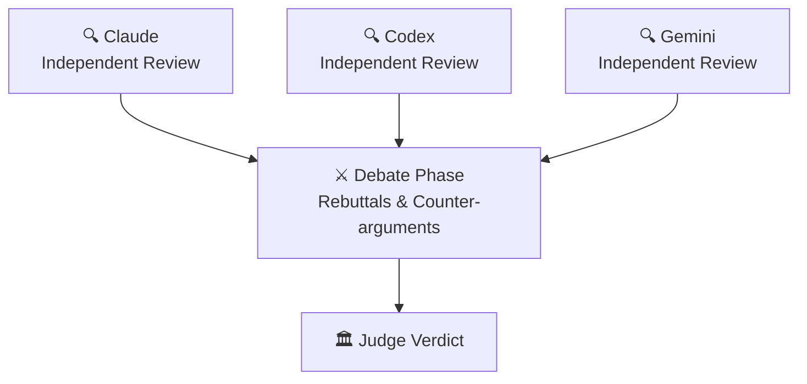
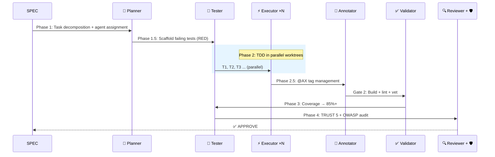
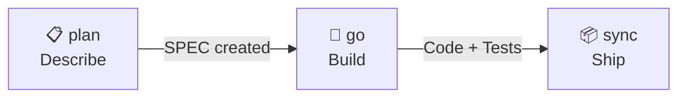

<div align="center">

# 🐙 Autopus-ADK

### The Autopus where AI agents remember, debate, and ship.

**Superpowers for AI Coding CLIs — 15 agents, 37 skills, one config, every platform.**

[](https://github.com/Insajin/autopus-adk/stargazers)
[](https://opensource.org/licenses/MIT)
[](https://golang.org)
[](#-one-config-five-platforms)
[](#-15-specialized-agents)
[](#-all-commands)

```bash
curl -sSfL https://raw.githubusercontent.com/Insajin/autopus-adk/main/install.sh | sh
```

[Why Autopus](#-the-problem) · [**Core Workflow**](#-the-workflow-three-commands-to-ship) · [Features](#-what-makes-autopus-different) · [Pipeline](#-the-pipeline) · [Docs](#-all-commands)

[🇰🇷 한국어](docs/README.ko.md)

</div>

---

## 🎬 See It In Action

<p align="center"></p>

```bash
# You describe what you want.
/auto plan "Add OAuth2 with Google and GitHub providers"

# 15 agents handle the rest — planning, testing, implementing, reviewing.
/auto go SPEC-AUTH-001 --auto --loop

# Docs, changelog, and SPEC status — all synced in one command.
/auto sync SPEC-AUTH-001
```

```
🐙 Pipeline ─────────────────────────────────────────────
  ✓ Phase 1:   Planning         planner decomposed 5 tasks
  ✓ Phase 1.5: Test Scaffold    12 failing tests created (RED)
  ✓ Phase 2:   Implementation   3 executors in parallel worktrees
  ✓ Phase 2.5: Annotation       @AX tags applied to 8 files
  ✓ Phase 3:   Testing          coverage: 62% → 91%
  ✓ Phase 4:   Review           TRUST 5: APPROVE | Security: PASS
  ───────────────────────────────────────────────────────
  ✅ 5/5 tasks │ 91% coverage │ 0 security issues │ 4m 32s
```

> 💡 One slash command. Production-ready code with tests, security audit, documentation, and decision history.

---

## 😤 The Problem

You're using AI coding tools. They're powerful. But...

- 🔄 **Platform lock-in** — Switch from Claude to Codex? Rewrite all your rules and prompts from scratch.
- 🎲 **Hope-driven development** — "Add auth" → AI writes code, skips tests, ignores security, forgets docs. *Maybe* it works.
- 🧠 **Amnesia** — Next session, the AI forgets every decision. "Why did we use this pattern?" → silence.
- 👤 **Solo agent** — One model, one context, one shot. Multi-file refactoring? Good luck.

---

## 🧠 The Philosophy: AX — Agent Experience

> **AX** is not "AI Transformation." AX is **Agent Experience** — how AI agents perceive, navigate, and operate within your codebase. Just as UX designs for users and DX designs for developers, **AX designs for agents.**

```
UX  =  User Experience        How users interact with your product
DX  =  Developer Experience   How developers interact with your tools
AX  =  Agent Experience       How AI agents interact with your codebase
```

Most AI coding tools are designed around a simple model: **you prompt, it responds.**

Autopus starts from a different question: *What if the agent is the primary audience of your project's documentation?*

Think about onboarding a new engineer. You wouldn't hand them a blank editor and say "build the auth system." You'd give them:
- An architecture overview so they understand the system
- Coding conventions so their code fits in
- Decision history so they don't repeat past mistakes
- A review process so mistakes get caught before shipping

**AI agents need the same things.** The difference is that every session is their first day.

Autopus is a **harness** — a structured environment that gives agents the context, constraints, and workflows they need to produce code that a senior engineer would approve. Not through hope. Through design.

### Four Principles

| Principle | What It Means |
|-----------|--------------|
| **Agent-First Authorship** | Rules, skills, and docs are written to be parsed by agents, not just read by humans. Structure over prose. |
| **Every Session is Day One** | Agents lose all context between sessions. The harness provides institutional memory — architecture, decisions, conventions — so they start informed, not blank. |
| **Constraints Liberate** | A 300-line file limit, mandatory TDD, quality gates — these aren't restrictions. They're guardrails that let agents focus on solving problems instead of inventing process. |
| **The Harness is the Culture** | In a human team, culture is implicit. For agents, it must be explicit. The harness encodes your team's standards so every agent — on every platform — works like your best engineer. |

> 🐙 **Autopus doesn't make agents smarter. It makes them informed. That's AX.**

---

## 🔥 What Makes Autopus Different

### 📏 Code That Agents Can Actually Read

Most codebases aren't written for AI. A 1,200-line file overwhelms context windows. Tangled responsibilities confuse intent. Autopus enforces a **hard 300-line limit** on every source file — not for aesthetics, but because **agents work better when each file has one job and fits in one read.**

```
❌ Traditional:
   service.go (1,200 lines) → Agent loses context halfway through

✅ Autopus:
   service.go       (180 lines)  Handler logic
   service_auth.go  (120 lines)  Auth middleware
   service_repo.go  (150 lines)  Data access
   → Every file fits in one context window. Every file has one job.
```

This isn't just about file size. The entire harness is **agent-readable by design:**

| Layer | How It's Agent-Friendly |
|-------|------------------------|
| **Rules** | Structured markdown with IMPORTANT markers — agents parse, not skim |
| **Skills** | YAML frontmatter with triggers — agents auto-activate the right skill |
| **Docs** | Tables over paragraphs, checklists over prose — parseable, not readable |
| **Code** | ≤ 300 lines, single responsibility, split by concern — fits in one context |

> 🐙 **Human-readable is a bonus. Agent-readable is the requirement.**

### 🤖 AI Agents That Form a Team, Not a Chatbot

Autopus doesn't give you one AI assistant — it gives you a **software engineering team of 15 specialized agents** with defined roles, quality gates, and retry logic.

```
🧠 Planner        →  Decomposes requirements into tasks
⚡ Executor ×N    →  Implements code in parallel worktrees
🧪 Tester         →  Writes tests BEFORE code (TDD enforced)
✅ Validator       →  Checks build, lint, vet
🔍 Reviewer       →  TRUST 5 code review
🛡️ Security       →  OWASP Top 10 audit
📝 Annotator      →  Documents code with @AX tags
🏗️ Architect      →  System design decisions
... and 7 more
```

### ⚔️ AI Models That Debate Each Other

Not one model reviewing your code — **multiple models arguing about it.**

```bash
auto orchestra review --strategy debate
```

Claude, Codex, and Gemini independently review your code, then **debate each other's findings** in a structured 2-phase argument. A judge renders the final verdict.



4 strategies: **Consensus** · **Debate** · **Pipeline** · **Fastest**

### 🔁 Self-Healing Pipeline (RALF Loop)

Quality gates don't just fail — they **fix themselves and retry.**

```bash
/auto go SPEC-AUTH-001 --auto --loop
```

```
🐙 RALF [Gate 2] ──────────────────
  Iteration: 1/5 │ Issues: 3
  → spawning executor to fix golangci-lint warnings...

🐙 RALF [Gate 2] ──────────────────
  Iteration: 2/5 │ Issues: 3 → 0
  Status: PASS ✅
```

**RALF = RED → GREEN → REFACTOR → LOOP** — TDD principles applied to the pipeline itself. Built-in circuit breaker prevents infinite loops.

### 🌳 Parallel Agents in Isolated Worktrees

Multiple executors work **simultaneously** — each in its own git worktree. No conflicts. No corruption.

```
Phase 2: Implementation
  ├── ⚡ Executor 1 (worktree/T1) → pkg/auth/provider.go     ✓
  ├── ⚡ Executor 2 (worktree/T2) → pkg/auth/handler.go      ✓
  └── ⚡ Executor 3 (worktree/T3) → pkg/auth/middleware.go    ✓

Phase 2.1: Merge (task-ID order)
  ✓ T1 merged → T2 merged → T3 merged → working branch
```

File ownership prevents conflicts. GC suppression prevents corruption. Up to **5 concurrent worktrees.**

### 📜 Lore: Your Codebase Never Forgets

Every commit captures the **why**, not just the what. Queryable forever.

```
feat(auth): add OAuth2 provider abstraction

Why: Need Google + GitHub support, extensible for future providers
Decision: Interface-based abstraction over direct SDK usage
Alternatives: Direct SDK calls (rejected: too coupled)
Ref: SPEC-AUTH-001

🐙 Autopus <noreply@autopus.co>
```

9 structured trailers. Query with `auto lore query "why interface?"`. Stale decisions auto-detected after 90 days.

### 🧪 Autonomous Experiment Loop

Let AI iterate autonomously — measure, keep or discard, repeat.

```bash
/auto experiment --metric "go test -bench=BenchmarkProcess" --direction lower --max-iter 5
```

```
🐙 Experiment ───────────────────────
  Iter 1: baseline  │ 1200 ns/op
  Iter 2: optimize  │  850 ns/op  ✓ keep (29% improvement)
  Iter 3: refactor  │  900 ns/op  ✗ discard (regression)
  Iter 4: cache     │  620 ns/op  ✓ keep (27% improvement)
  ─────────────────────────────────────
  Result: 1200 → 620 ns/op (48% improvement)
```

Built-in **circuit breaker** prevents runaway iterations. **Simplicity scoring** penalizes over-complex solutions. Each iteration is a git commit — easy to review or revert.

### 🌐 One Config, Five Platforms

```bash
auto init   # auto-detects all installed AI coding CLIs
```

One `autopus.yaml` generates **native configuration** for every detected platform.

| Platform | What Gets Generated |
|----------|-------------------|
| **Claude Code** | `.claude/rules/`, `.claude/skills/`, `.claude/agents/`, `CLAUDE.md` |
| **Codex** | `.codex/`, `AGENTS.md` |
| **Gemini CLI** | `.gemini/`, `GEMINI.md` |
| **Cursor** | `.cursor/rules/`, `.cursorrules` |
| **OpenCode** | `.opencode/`, `agents.json` |

Same 15 agents. Same 37 skills. Same rules. **Everywhere.**

---

## 🚀 Quick Start Guide

Get from zero to your first AI-powered feature in under 5 minutes.

### Step 1 · Install Autopus

```bash
curl -sSfL https://raw.githubusercontent.com/Insajin/autopus-adk/main/install.sh | sh
```

<details>
<summary>Other install methods</summary>

```bash
# go install (requires Go 1.26+)
go install github.com/Insajin/autopus-adk/cmd/auto@latest

# Build from source
git clone https://github.com/Insajin/autopus-adk.git
cd autopus-adk && make build && make install
```

</details>

### Step 2 · Initialize Your Project

```bash
cd your-project
auto init
```

`auto init` scans your machine for installed AI coding CLIs (Claude Code, Codex, Gemini CLI, Cursor, OpenCode) and generates **native configuration** for each one — rules, skills, agents, and platform-specific settings — all from a single `autopus.yaml`.

```
✓ Detected: claude-code, gemini-cli
✓ Generated: .claude/rules/, .claude/skills/, .claude/agents/, CLAUDE.md
✓ Generated: .gemini/, GEMINI.md
✓ Created: autopus.yaml
```

### Step 3 · Set Up Project Context (`/auto setup`)

This is the most important step. **AI agents lose all memory between sessions** — every conversation is their first day on the job. `/auto setup` creates the "onboarding documents" that let agents understand your project instantly.

```bash
auto setup      # CLI
/auto setup     # inside AI Coding CLI (e.g., Claude Code)
```

This analyzes your codebase and generates 5 context documents:

```
ARCHITECTURE.md                    # Domains, layers, dependency map
.autopus/project/product.md       # What this project does, core features
.autopus/project/structure.md     # Directory layout, package roles, entry points
.autopus/project/tech.md          # Tech stack, build system, testing strategy
.autopus/project/scenarios.md     # E2E test scenarios extracted from code
```

> 💡 **Why this matters:** Without these documents, an AI agent looking at your project is like a new hire with no onboarding — they'll guess at architecture, miss conventions, and reinvent patterns that already exist. With `/auto setup`, every agent session starts informed.

### Step 4 · Build Your First Feature

Now you're ready. Describe what you want in plain language:

```bash
# 1. Plan — AI creates a full SPEC (requirements, tasks, acceptance criteria)
/auto plan "Add a health check endpoint at GET /healthz"

# 2. Build — 15 agents handle implementation, testing, and review
/auto go SPEC-HEALTH-001 --auto

# 3. Ship — Sync docs, update SPEC status, commit with decision history
/auto sync SPEC-HEALTH-001
```

```
╭────────────────────────────────────╮
│ 🐙 Pipeline Complete!              │
│ SPEC-HEALTH-001: Health Check      │
│ Tasks: 3/3 │ Coverage: 92%         │
│ Review: APPROVE                    │
╰────────────────────────────────────╯
```

That's it — production-ready code with tests, security audit, and full documentation, driven by three commands.

### Quick Reference

| What you want | Command |
|--------------|---------|
| Initialize in a new project | `auto init` |
| Generate project context | `/auto setup` |
| Plan a new feature | `/auto plan "description"` |
| Implement a SPEC | `/auto go SPEC-ID --auto` |
| Full autonomy + self-healing | `/auto go SPEC-ID --auto --loop` |
| Fix a bug | `/auto fix "description"` |
| One-shot plan→build→ship | `/auto dev "description"` |
| Update docs after changes | `/auto sync SPEC-ID` |

---

## 🤖 The Pipeline

### 7-Phase Multi-Agent Pipeline

Every `/auto go` runs this:



### 15 Specialized Agents

| Agent | Role | When |
|-------|------|------|
| **Planner** | SPEC decomposition, task assignment, complexity assessment | Phase 1 |
| **Spec Writer** | Generate spec.md, plan.md, acceptance.md, research.md | `/auto plan` |
| **Tester** | Test scaffold (RED) + coverage boost (GREEN) | Phase 1.5, 3 |
| **Executor** | TDD implementation in parallel worktrees | Phase 2 |
| **Annotator** | @AX tag lifecycle management | Phase 2.5 |
| **Validator** | Build, vet, lint, file size checks | Gate 2 |
| **Reviewer** | TRUST 5 code review | Phase 4 |
| **Security Auditor** | OWASP Top 10 vulnerability scan | Phase 4 |
| **Architect** | System design, architecture decisions | on-demand |
| **Debugger** | Reproduction-first bug fixing | `/auto fix` |
| **DevOps** | CI/CD, Docker, infrastructure | on-demand |
| **Frontend Specialist** | Playwright E2E + VLM visual regression | Phase 3.5 |
| **UX Validator** | Frontend component visual validation | Phase 3.5 |
| **Perf Engineer** | Benchmark, pprof, regression detection | on-demand |
| **Explorer** | Codebase structure analysis | `/auto map` |

### Quality Modes

```bash
/auto go SPEC-ID --quality ultra      # All agents on Opus — max quality
/auto go SPEC-ID --quality balanced   # Adaptive: Opus/Sonnet/Haiku by task complexity
```

| Mode | Planner | Executor | Validator | Cost |
|------|---------|----------|-----------|------|
| **Ultra** | Opus | Opus | Opus | $$$ |
| **Balanced** | Opus | Adaptive* | Haiku | $ |

\* HIGH complexity → Opus · MEDIUM → Sonnet · LOW → Haiku

### Execution Modes

| Flag | Mode | Description |
|------|------|-------------|
| *(default)* | Subagent pipeline | Main session orchestrates Agent() calls |
| `--team` | Agent Teams | Lead / Builder / Guardian role-based teams |
| `--solo` | Single session | No subagents, direct TDD |
| `--auto --loop` | Full autonomy | RALF self-healing, no human gates |
| `--multi` | Multi-provider | Debate/consensus review with multiple models |

---

## 📐 The Workflow: Three Commands to Ship

Every feature in Autopus follows the same **plan → go → sync** lifecycle. No exceptions.



### 📋 Step 1 · `/auto plan` — Describe What You Want

Turn a plain-English description into a full **SPEC** — requirements, tasks, acceptance criteria, and risk analysis.

```bash
/auto plan "Add webhook delivery with retry and dead letter queue"
```

The spec-writer agent produces 5 documents:

```
.autopus/specs/SPEC-HOOK-001/
├── prd.md          # Product Requirements Document
├── spec.md         # EARS-format requirements
├── plan.md         # Task breakdown + agent assignments
├── acceptance.md   # Given-When-Then criteria
└── research.md     # Technical research + risks
```

Options: `--multi` for multi-provider review · `--prd-mode minimal` for lightweight PRDs · `--skip-prd` to go straight to SPEC

### 🚀 Step 2 · `/auto go` — Build It

Feed the SPEC to **15 agents** that plan, scaffold tests, implement in parallel, validate, annotate, test, and review — all automatically.

```bash
/auto go SPEC-HOOK-001 --auto --loop
```

```
Phase 1    │ 🧠 Planner         │ SPEC → tasks + agent assignments
Phase 1.5  │ 🧪 Tester          │ Failing test skeletons (RED)
Phase 2    │ ⚡ Executor ×N      │ TDD in parallel worktrees
Phase 2.5  │ 📝 Annotator       │ @AX documentation tags
Gate  2    │ ✅ Validator        │ Build + lint + vet
Phase 3    │ 🧪 Tester          │ Coverage → 85%+
Phase 4    │ 🔍 Reviewer + 🛡️    │ TRUST 5 + OWASP audit
```

Options: `--team` for Agent Teams · `--solo` for single-session TDD · `--quality ultra` for all-Opus execution · `--multi` for multi-model review

### 📦 Step 3 · `/auto sync` — Ship and Document

Update SPEC status, regenerate project docs, manage @AX tag lifecycle, and commit with structured Lore history.

```bash
/auto sync SPEC-HOOK-001
```

```
╭────────────────────────────────────╮
│ 🐙 Pipeline Complete!              │
│ SPEC-HOOK-001: Webhook Delivery    │
│ Tasks: 5/5 │ Coverage: 91%         │
│ Review: APPROVE                    │
╰────────────────────────────────────╯
```

**That's it.** Three commands: describe → build → ship. Every decision recorded. Every test enforced.

---

## 🎯 TRUST 5 Code Review

Every review scores across 5 dimensions:

| | Dimension | What It Checks |
|---|-----------|----------------|
| **T** | Tested | 85%+ coverage, edge cases, `go test -race` |
| **R** | Readable | Clear naming, single responsibility, ≤ 300 LOC |
| **U** | Unified | gofmt, goimports, golangci-lint, consistent patterns |
| **S** | Secured | OWASP Top 10, no injection, no hardcoded secrets |
| **T** | Trackable | Meaningful logs, error context, SPEC/Lore references |

---

## 📊 Multi-Model Orchestration

| Strategy | How It Works | Best For |
|----------|-------------|----------|
| **🤝 Consensus** | Independent answers merged by key agreement | Planning, code review |
| **⚔️ Debate** | 2-phase adversarial review + judge verdict | Critical decisions, security |
| **🔗 Pipeline** | Provider N's output → Provider N+1's input | Iterative refinement |
| **⚡ Fastest** | First completed response wins | Quick queries |

Providers: **Claude** · **Codex** · **Gemini** — with graceful degradation.

---

## 📖 All Commands

<details>
<summary><strong>CLI Commands</strong> (21 root commands, 55+ total with subcommands)</summary>

| Command | Description |
|---------|-------------|
| `auto init` | Initialize harness — detect platforms, generate files |
| `auto update` | Update harness (preserves user edits via markers) |
| `auto doctor` | Health diagnostics |
| `auto platform` | Manage platforms (list / add / remove) |
| `auto arch` | Architecture analysis (generate / lint) |
| `auto spec` | SPEC management (new / validate / review) |
| `auto lore` | Decision tracking (context / commit / validate / stale) |
| `auto orchestra` | Multi-model orchestration (review / plan / secure / brainstorm) |
| `auto setup` | Project context documents (generate / update / validate) |
| `auto status` | SPEC dashboard (done / in-progress / draft) |
| `auto telemetry` | Pipeline telemetry (record / summary / cost / compare) |
| `auto skill` | Skill management (list / info) |
| `auto search` | Knowledge search (Exa) |
| `auto docs` | Library documentation lookup (Context7) |
| `auto lsp` | LSP integration (diagnostics / refs / rename / symbols) |
| `auto verify` | Frontend UX verification (Playwright + VLM) |
| `auto check` | Harness rule checks (anti-pattern scanning) |
| `auto hash` | File hashing (xxhash) |
| `auto issue` | Auto issue reporter (error context collection, GitHub submission) |
| `auto experiment` | Autonomous experiment loop (metric-driven keep/discard) |

</details>

<details>
<summary><strong>Slash Commands</strong> (inside AI Coding CLI)</summary>

| Command | Description |
|---------|-------------|
| `/auto plan "description"` | Create a SPEC for a new feature |
| `/auto go SPEC-ID` | Implement with full pipeline |
| `/auto go SPEC-ID --auto --loop` | Fully autonomous + self-healing |
| `/auto go SPEC-ID --team` | Agent Teams (Lead/Builder/Guardian) |
| `/auto go SPEC-ID --multi` | Multi-provider orchestration |
| `/auto fix "bug"` | Reproduction-first bug fix |
| `/auto review` | TRUST 5 code review |
| `/auto secure` | OWASP Top 10 security audit |
| `/auto map` | Codebase structure analysis |
| `/auto sync SPEC-ID` | Sync docs after implementation |
| `/auto dev "description"` | One-shot: plan → go → sync |
| `/auto setup` | Generate/update project context docs |
| `/auto stale` | Detect stale decisions and patterns |
| `/auto why "question"` | Query decision rationale |
| `/auto experiment` | Autonomous experiment loop (metric-driven iteration) |

</details>

---

## ⚙️ Configuration

<details>
<summary><strong><code>autopus.yaml</code></strong> — single config for everything</summary>

```yaml
mode: full                    # full or lite
project_name: my-project
platforms:
  - claude-code

architecture:
  auto_generate: true
  enforce: true

lore:
  enabled: true
  required_trailers: [Why, Decision]
  stale_threshold_days: 90

spec:
  review_gate:
    enabled: true
    strategy: debate
    providers: [claude, gemini]
    judge: claude

methodology:
  mode: tdd
  enforce: true

orchestra:
  enabled: true
  default_strategy: consensus
  providers:
    claude:
      binary: claude
    codex:
      binary: codex
    gemini:
      binary: gemini
```

</details>

---

## 🏗️ Architecture

```
autopus-adk/
├── cmd/auto/           # Entry point
├── internal/cli/       # 21 Cobra commands (55+ with subcommands)
├── pkg/
│   ├── adapter/        # 5 platform adapters (Claude, Codex, Gemini, Cursor, OpenCode)
│   ├── orchestra/      # Multi-model orchestration (4 strategies + brainstorm)
│   ├── spec/           # SPEC engine (EARS format)
│   ├── lore/           # Decision tracking (9-trailer protocol)
│   ├── content/        # Agent/skill/hook generation + skill activator
│   ├── arch/           # Architecture analysis + rule enforcement
│   ├── sigmap/         # go/ast API signature extraction
│   ├── constraint/     # Anti-pattern scanning
│   ├── telemetry/      # Pipeline telemetry + cost estimation
│   ├── cost/           # Token-based cost estimator
│   ├── setup/          # Project doc generation
│   ├── lsp/            # LSP integration
│   ├── search/         # Knowledge search (Context7/Exa)
│   ├── issue/          # Auto issue reporter (context collection, sanitization)
│   ├── experiment/     # Autonomous experiment loop (metric execution, circuit breaker)
│   └── ...             # template, detect, config, version
├── templates/          # Platform-specific templates
├── content/            # Embedded content (15 agents, 37 skills)
└── configs/            # Default configuration
```

---

## 🤝 Contributing

Autopus-ADK is open source under the MIT license. PRs welcome!

```bash
make test       # Run tests with race detection
make lint       # Run go vet
make coverage   # Generate coverage report
```

---

<div align="center">

**🐙 Autopus** — Remember. Debate. Ship.

</div>
