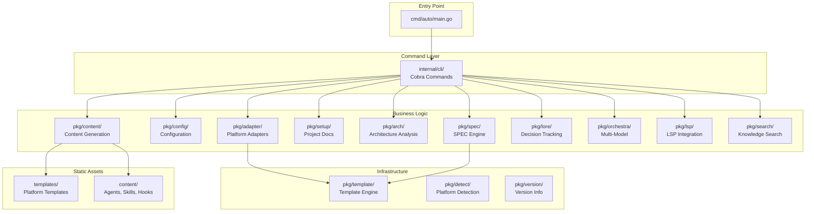
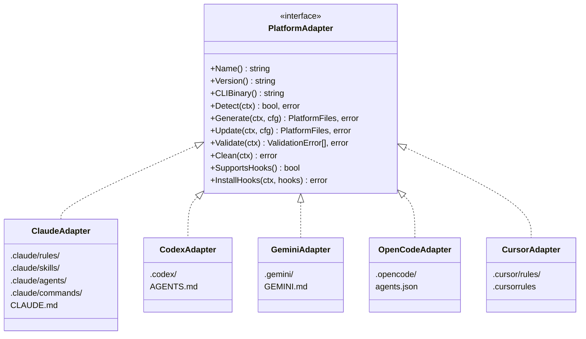
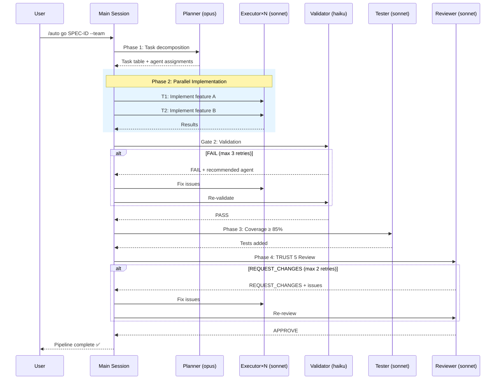
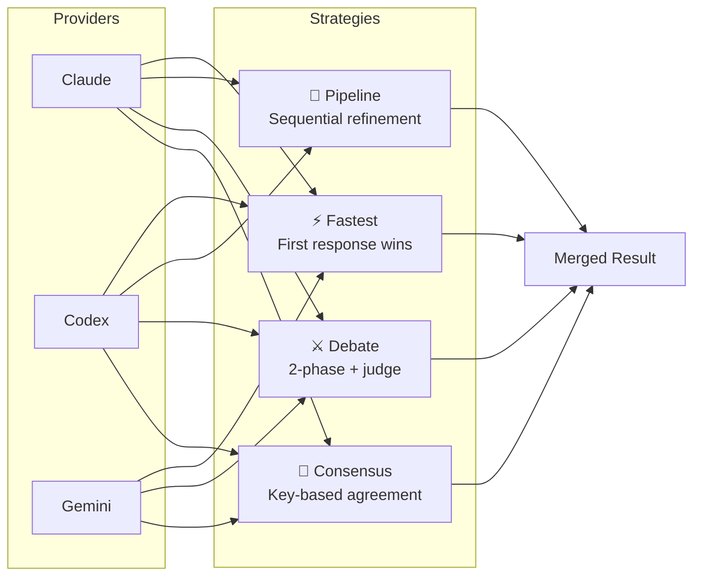
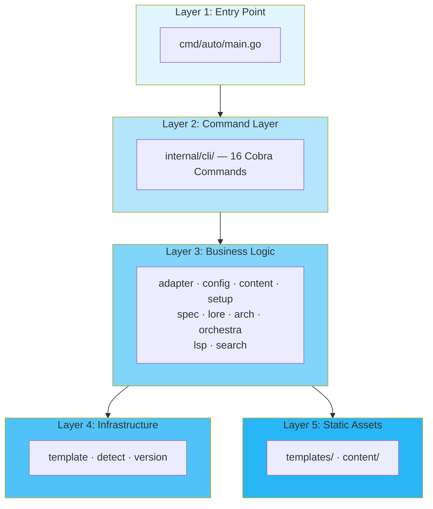

<p align="center">
  
  
  
  
</p>

<h1 align="center">🐙 Autopus-ADK</h1>
<h3 align="center">Agentic Development Kit</h3>

<p align="center">
  Install the Autopus harness across multiple AI coding CLI platforms.<br>
  One config — consistent agents, skills, hooks, and workflows everywhere.
</p>

<p align="center">
  <a href="#-quick-start">Quick Start</a> •
  <a href="#-architecture">Architecture</a> •
  <a href="#-user-guide">User Guide</a> •
  <a href="#-platforms">Platforms</a> •
  <a href="#-configuration">Configuration</a>
</p>

<p align="center">
  <a href="docs/README.ko.md">🇰🇷 한국어</a>
</p>

---

## What is Autopus-ADK?

Autopus-ADK is a Go CLI tool that installs the **Autopus harness** into AI coding CLI platforms. It provides a unified development environment with:

- **11 specialized agents** (planner, executor, tester, validator, reviewer, etc.)
- **29 skills** (TDD, debugging, security audit, code review, etc.)
- **SPEC-driven development** with EARS requirement syntax
- **Lore decision tracking** with a 9-trailer commit protocol
- **Multi-model orchestration** (consensus, debate, pipeline, fastest)
- **Multi-agent pipeline** (planner → executor → tester → validator → reviewer)
- **Architecture analysis** and rule enforcement
- **5 platform adapters** with a single `autopus.yaml` config

## 🚀 Quick Start

### Installation

```bash
# From source
git clone https://github.com/insajin/autopus-adk.git
cd autopus-adk
make build
make install

# Verify
auto --version
```

### Initialize a Project

```bash
# Detect platforms and generate harness files
auto init

# Generate project context documents
auto setup
```

This creates:
- `autopus.yaml` — project configuration
- `ARCHITECTURE.md` — architecture map
- `.autopus/project/` — product, structure, and tech docs
- Platform-specific files (e.g., `.claude/rules/`, `.claude/skills/`, `.claude/agents/`)

### First Workflow

```bash
# 1. Plan — create a SPEC
auto spec new "Add user authentication"

# 2. Review the SPEC (multi-provider)
auto spec review SPEC-AUTH-001

# 3. Implement with TDD
# (inside your AI coding CLI)
/auto go SPEC-AUTH-001

# 4. Sync documentation
/auto sync SPEC-AUTH-001
```

## 🏗 Architecture

### High-Level Overview



### Platform Adapter Pattern



### Multi-Agent Pipeline (`--team` mode)



### Multi-Model Orchestration



### Layer Architecture



## 📖 User Guide

### Commands Overview

| Command | Description |
|---------|-------------|
| `auto init` | Initialize harness — detect platforms, generate files |
| `auto update` | Update harness files (preserves user edits via markers) |
| `auto doctor` | Health check — verify installation integrity |
| `auto platform` | List detected CLI platforms |
| `auto arch generate` | Analyze codebase and generate `ARCHITECTURE.md` |
| `auto arch lint` | Validate architecture rules |
| `auto spec new` | Create a new SPEC with EARS requirements |
| `auto spec review` | Multi-provider SPEC review gate |
| `auto lore query` | Query decision history |
| `auto orchestra review` | Multi-model orchestration review |
| `auto setup` | Generate project context documents |
| `auto skill list` | List available skills |
| `auto search` | Knowledge search (Context7/Exa) |
| `auto lsp` | LSP integration commands |
| `auto hash` | Compute file hashes |

### Slash Commands (inside AI Coding CLI)

When using Autopus inside your coding CLI (e.g., Claude Code), use these slash commands:

| Command | Description |
|---------|-------------|
| `/auto plan "description"` | Create a SPEC for a new feature |
| `/auto go SPEC-ID` | Implement a SPEC with TDD |
| `/auto go SPEC-ID --team` | Multi-agent pipeline implementation |
| `/auto go SPEC-ID --team --auto` | Fully autonomous pipeline |
| `/auto go SPEC-ID --multi` | Multi-provider orchestration |
| `/auto fix "bug description"` | Debug and fix a bug |
| `/auto review` | Code review (TRUST 5) |
| `/auto secure` | Security audit (OWASP Top 10) |
| `/auto map` | Codebase structure analysis |
| `/auto sync SPEC-ID` | Sync docs after implementation |
| `/auto setup` | Generate/update project context docs |

### SPEC-Driven Development Workflow

The recommended development workflow follows the **plan → go → sync** cycle:

```
┌─────────┐     ┌─────────┐     ┌─────────┐
│  plan   │────▶│   go    │────▶│  sync   │
│ (SPEC)  │     │ (TDD)   │     │ (docs)  │
└─────────┘     └─────────┘     └─────────┘
     │               │               │
     ▼               ▼               ▼
  spec.md      Source code     ARCHITECTURE.md
  plan.md      *_test.go      Updated docs
  acceptance.md                CHANGELOG.md
  research.md
```

**Step 1: Plan**
```bash
/auto plan "Add OAuth2 authentication with Google and GitHub providers"
```
This creates 4 files in `.autopus/specs/SPEC-AUTH-001/`:
- `spec.md` — Requirements in EARS format
- `plan.md` — Implementation plan with task breakdown
- `acceptance.md` — Acceptance criteria
- `research.md` — Technical research notes

**Step 2: Go (Implement)**
```bash
# Single session (default)
/auto go SPEC-AUTH-001

# Multi-agent pipeline
/auto go SPEC-AUTH-001 --team

# Fully autonomous with RALF loop (auto-retry failed gates)
/auto go SPEC-AUTH-001 --team --auto --loop
```

**Step 3: Sync**
```bash
/auto sync SPEC-AUTH-001
```

### Lore: Decision Tracking

Every commit uses the Lore format to capture **why** decisions were made:

```
feat(auth): add OAuth2 provider abstraction

Implement provider interface to support multiple OAuth2 providers
without coupling to specific implementations.

Why: Need to support Google and GitHub initially, with extensibility for future providers
Decision: Interface-based abstraction over direct SDK usage
Alternatives: Direct SDK calls (rejected: too coupled), Generic HTTP client (rejected: loses type safety)
Ref: SPEC-AUTH-001

🐙 Autopus <noreply@autopus.co>
```

Required trailers: `Why`, `Decision`
Optional trailers: `Alternatives`, `Ref`, `Risk`, `Context`, `Scope`, `Blocked-By`, `Supersedes`

### Multi-Model Orchestration

Run tasks across multiple AI models and merge results:

```bash
# Consensus — all providers answer, merge by agreement
auto orchestra review --strategy consensus

# Debate — providers argue, judge decides
auto orchestra review --strategy debate

# Pipeline — sequential refinement
auto orchestra review --strategy pipeline

# Fastest — first response wins
auto orchestra review --strategy fastest
```

**Strategies:**

| Strategy | How it works | Best for |
|----------|-------------|----------|
| Consensus | All providers answer independently, results merged by key agreement | Code review, planning |
| Debate | 2-phase debate with rebuttal, judge renders verdict | Controversial decisions |
| Pipeline | Output of provider N becomes input of provider N+1 | Iterative refinement |
| Fastest | First completed response is used | Quick queries |

### TDD Methodology

Autopus enforces Test-Driven Development:

1. **RED** — Write a failing test first
2. **GREEN** — Write minimum code to pass
3. **REFACTOR** — Clean up while keeping tests green

```go
// RED: Write the test first
func TestCalculateDiscount_WithPremiumUser_Returns20Percent(t *testing.T) {
    t.Parallel()
    user := User{Tier: "premium"}
    got := CalculateDiscount(user, 100.0)
    assert.Equal(t, 80.0, got)
}
```

### Code Review: TRUST 5

Reviews are scored across 5 dimensions:

| Dimension | Checks |
|-----------|--------|
| **T**ested | 85%+ coverage, edge cases, race condition tests |
| **R**eadable | Clear naming, single responsibility, appropriate comments |
| **U**nified | Consistent style, gofmt/goimports, golangci-lint clean |
| **S**ecured | No injection, input validation, no hardcoded secrets |
| **T**rackable | Meaningful logs, contextual errors, SPEC references |

### File Size Limit

Hard limit: **300 lines** per source file. Target under 200 lines.

Splitting strategies:
- By type: Move structs and methods to separate files
- By concern: Group related functions
- By layer: Separate handler, service, repository

Exclusions: generated files (`*_generated.go`), docs (`*.md`), config (`*.yaml`)

## 🔌 Platforms

| Platform | Binary | Adapter | Status |
|----------|--------|---------|--------|
| Claude Code | `claude` | `pkg/adapter/claude/` | ✅ Full support |
| Codex | `codex` | `pkg/adapter/codex/` | ✅ Full support |
| Gemini CLI | `gemini` | `pkg/adapter/gemini/` | ✅ Full support |
| OpenCode | `opencode` | `pkg/adapter/opencode/` | ✅ Full support |
| Cursor | `cursor` | `pkg/adapter/cursor/` | ✅ Full support |

### Adding a New Platform

1. Create `pkg/adapter/<name>/<name>.go` implementing `PlatformAdapter`
2. Add templates in `templates/<name>/`
3. Register in `pkg/adapter/registry.go`

## ⚙️ Configuration

### `autopus.yaml`

```yaml
mode: full                    # full or lite
project_name: my-project
platforms:
  - claude-code

# Architecture analysis
architecture:
  auto_generate: true
  enforce: true
  layers: [cmd, internal, pkg, domain, infrastructure]

# Decision tracking
lore:
  enabled: true
  auto_inject: true
  required_trailers: [Why, Decision]
  stale_threshold_days: 90

# SPEC engine
spec:
  id_format: "SPEC-{NAME}-{NUMBER}"
  ears_types: [ubiquitous, event_driven, unwanted_behavior, state_driven, optional]
  review_gate:
    enabled: true
    strategy: debate
    providers: [claude, gemini]
    judge: claude
    max_revisions: 2

# TDD methodology
methodology:
  mode: tdd
  enforce: true
  review_gate: true

# Model routing
router:
  strategy: category
  tiers:
    fast: gemini-2.0-flash
    smart: claude-sonnet-4
    ultra: claude-opus-4
  categories:
    visual: fast
    deep: ultra
    quick: fast

# Multi-model orchestration
orchestra:
  enabled: true
  default_strategy: consensus
  timeout_seconds: 120
  providers:
    claude:
      binary: claude
      args: ["-p"]
    codex:
      binary: codex
      args: ["-q"]
    gemini:
      binary: gemini
      prompt_via_args: true

# Hooks
hooks:
  pre_commit_arch: true
  pre_commit_lore: true

# Session continuity
session:
  handoff_enabled: true
  continue_file: .auto-continue.md
  max_context_tokens: 2000
```

### Modes

| Mode | Features |
|------|----------|
| **Full** | All features: agents, skills, hooks, SPEC, Lore, orchestra, TDD |
| **Lite** | Minimal: basic skills + rules only |

## 🛠 Development

### Build

```bash
make build      # Build binary to bin/auto
make test       # Run tests with race detection
make lint       # Run go vet
make coverage   # Generate coverage report
make install    # Install to $GOPATH/bin
```

### Project Structure

```
autopus-adk/
├── cmd/auto/           # Entry point
├── internal/cli/       # 16 Cobra commands
├── pkg/
│   ├── adapter/        # 5 platform adapters
│   ├── config/         # YAML config schema
│   ├── content/        # Agent/skill/hook generation
│   ├── setup/          # Project documentation
│   ├── arch/           # Architecture analysis
│   ├── spec/           # SPEC engine (EARS)
│   ├── lore/           # Decision tracking (9-trailer)
│   ├── orchestra/      # Multi-model orchestration
│   ├── lsp/            # LSP integration
│   ├── search/         # Knowledge search
│   ├── template/       # Go template engine
│   ├── detect/         # Platform detection
│   └── version/        # Build metadata
├── templates/          # Platform-specific templates
├── content/            # Embedded content (11 agents, 29 skills)
└── configs/            # Default configuration
```

### Architecture Rules

- `internal/cli` depends on `pkg/*` only (never reverse)
- `pkg/*` packages do not depend on each other (except `pkg/template`)
- `cmd/` contains only the entry point
- Platform-specific code lives in `pkg/adapter/{platform}/`
- No file exceeds 300 lines

---

<p align="center">
  <b>🐙 Autopus</b> — One harness, every platform.
</p>
