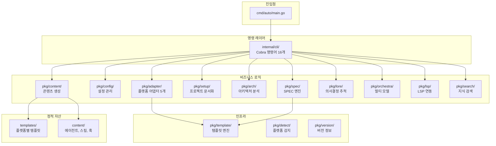
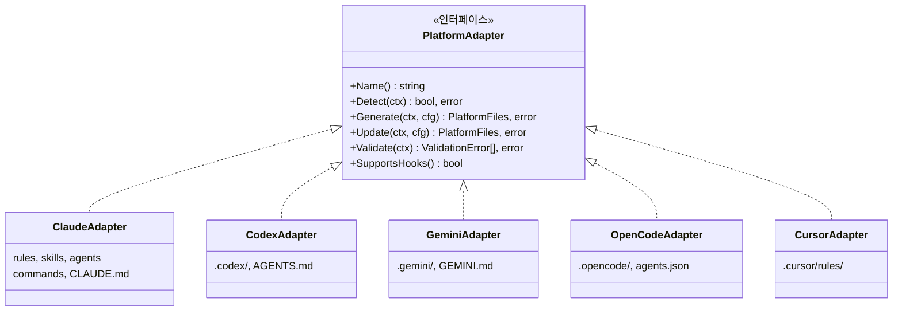
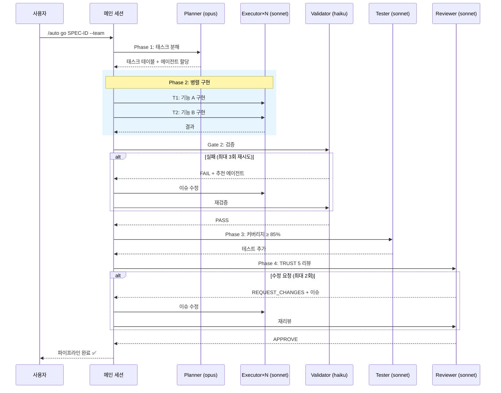
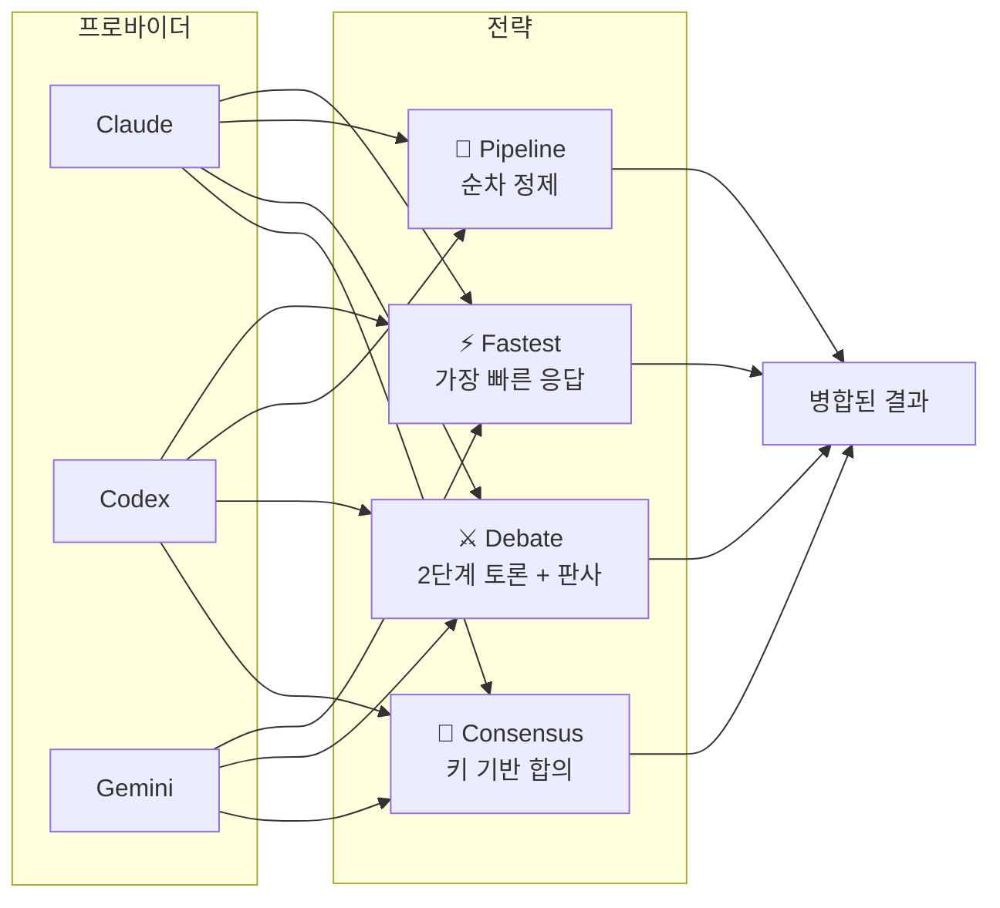
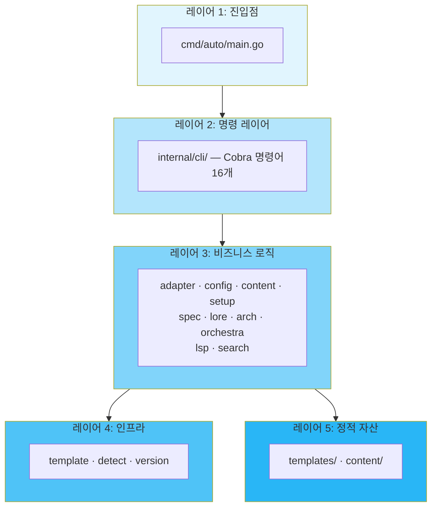

<p align="center">
  
  
  
  
</p>

<h1 align="center">🐙 Autopus-ADK</h1>
<h3 align="center">Agentic Development Kit</h3>

<p align="center">
  AI 코딩 CLI 플랫폼에 Autopus 하네스를 설치합니다.<br>
  하나의 설정으로 에이전트, 스킬, 훅, 워크플로우를 모든 플랫폼에서 일관되게.
</p>

<p align="center">
  <a href="../README.md">🇺🇸 English</a>
</p>

---

## Autopus-ADK란?

Autopus-ADK는 AI 코딩 CLI 플랫폼에 **Autopus 하네스**를 설치하는 Go CLI 도구입니다. 하나의 설정으로 일관된 개발 환경을 제공합니다:

- **11개 전문 에이전트** (planner, executor, tester, validator, reviewer 등)
- **29개 스킬** (TDD, 디버깅, 보안 감사, 코드 리뷰 등)
- **SPEC 기반 개발** — EARS 요구사항 문법
- **Lore 의사결정 추적** — 9-trailer 커밋 프로토콜
- **멀티 모델 오케스트레이션** (consensus, debate, pipeline, fastest)
- **멀티 에이전트 파이프라인** (planner → executor → tester → validator → reviewer)
- **아키텍처 분석** 및 규칙 강제
- **5개 플랫폼 어댑터** — 하나의 `autopus.yaml` 설정으로 통합

## 🚀 빠른 시작

### 설치

```bash
# 소스에서 빌드
git clone https://github.com/insajin/autopus-adk.git
cd autopus-adk
make build
make install

# 확인
auto --version
```

### 프로젝트 초기화

```bash
# 플랫폼 감지 및 하네스 파일 생성
auto init

# 프로젝트 컨텍스트 문서 생성
auto setup
```

생성되는 파일:
- `autopus.yaml` — 프로젝트 설정
- `ARCHITECTURE.md` — 아키텍처 맵
- `.autopus/project/` — 제품, 구조, 기술 문서
- 플랫폼별 파일 (예: `.claude/rules/`, `.claude/skills/`, `.claude/agents/`)

### 첫 번째 워크플로우

```bash
# 1. 기획 — SPEC 작성
auto spec new "사용자 인증 추가"

# 2. SPEC 리뷰 (멀티 프로바이더)
auto spec review SPEC-AUTH-001

# 3. TDD로 구현 (AI 코딩 CLI 내부에서)
/auto go SPEC-AUTH-001

# 4. 문서 동기화
/auto sync SPEC-AUTH-001
```

## 🏗 아키텍처

### 전체 구조



### 플랫폼 어댑터 패턴



### 멀티 에이전트 파이프라인 (`--team` 모드)



### 멀티 모델 오케스트레이션 전략



### 레이어 구조



## 📖 사용자 가이드

### CLI 명령어 목록

| 명령어 | 설명 |
|--------|------|
| `auto init` | 하네스 초기화 — 플랫폼 감지, 파일 생성 |
| `auto update` | 하네스 업데이트 (마커 기반 부분 업데이트, 사용자 편집 보존) |
| `auto doctor` | 상태 진단 — 설치 무결성 검증 |
| `auto platform` | 감지된 CLI 플랫폼 목록 |
| `auto arch generate` | 코드베이스 분석, `ARCHITECTURE.md` 생성 |
| `auto arch lint` | 아키텍처 규칙 검증 |
| `auto spec new` | EARS 형식 SPEC 생성 |
| `auto spec review` | 멀티 프로바이더 SPEC 리뷰 게이트 |
| `auto lore query` | 의사결정 히스토리 조회 |
| `auto orchestra review` | 멀티 모델 오케스트레이션 리뷰 |
| `auto setup` | 프로젝트 컨텍스트 문서 생성/업데이트 |
| `auto skill list` | 사용 가능한 스킬 목록 |
| `auto search` | 지식 검색 (Context7/Exa) |
| `auto lsp` | LSP 연동 명령 |

### 슬래시 명령어 (AI 코딩 CLI 내부)

코딩 CLI (예: Claude Code) 내부에서 사용하는 슬래시 명령어:

| 명령어 | 설명 |
|--------|------|
| `/auto plan "설명"` | 새 기능 SPEC 작성 |
| `/auto go SPEC-ID` | TDD 기반 SPEC 구현 |
| `/auto go SPEC-ID --team` | 멀티 에이전트 파이프라인 구현 |
| `/auto go SPEC-ID --team --auto` | 완전 자율 파이프라인 |
| `/auto go SPEC-ID --multi` | 멀티 프로바이더 오케스트레이션 |
| `/auto fix "버그 설명"` | 버그 디버깅 및 수정 |
| `/auto review` | 코드 리뷰 (TRUST 5) |
| `/auto secure` | 보안 감사 (OWASP Top 10) |
| `/auto map` | 코드베이스 구조 분석 |
| `/auto sync SPEC-ID` | 구현 후 문서 동기화 |
| `/auto setup` | 프로젝트 컨텍스트 문서 생성/업데이트 |

### SPEC 기반 개발 워크플로우

권장 개발 워크플로우는 **plan → go → sync** 사이클입니다:

```
┌─────────┐     ┌─────────┐     ┌─────────┐
│  plan   │────▶│   go    │────▶│  sync   │
│ (SPEC)  │     │ (TDD)   │     │ (문서)  │
└─────────┘     └─────────┘     └─────────┘
     │               │               │
     ▼               ▼               ▼
  spec.md       소스 코드      ARCHITECTURE.md
  plan.md       *_test.go     업데이트된 문서
  acceptance.md               CHANGELOG.md
  research.md
```

**1단계: Plan (기획)**
```bash
/auto plan "Google과 GitHub 프로바이더를 지원하는 OAuth2 인증 추가"
```
`.autopus/specs/SPEC-AUTH-001/`에 4개 파일 생성:
- `spec.md` — EARS 형식 요구사항
- `plan.md` — 태스크 분해 구현 계획
- `acceptance.md` — 수락 기준
- `research.md` — 기술 조사 메모

**2단계: Go (구현)**
```bash
# 단일 세션 (기본)
/auto go SPEC-AUTH-001

# 멀티 에이전트 파이프라인
/auto go SPEC-AUTH-001 --team

# 완전 자율 모드 (RALF 루프: 품질 게이트 자동 재시도)
/auto go SPEC-AUTH-001 --team --auto --loop
```

**3단계: Sync (문서 동기화)**
```bash
/auto sync SPEC-AUTH-001
```

### Lore: 의사결정 추적

모든 커밋은 Lore 형식으로 **왜** 그런 결정을 했는지 기록합니다:

```
feat(auth): OAuth2 프로바이더 추상화 추가

특정 구현에 결합되지 않고 여러 OAuth2 프로바이더를
지원하기 위한 프로바이더 인터페이스 구현.

Why: Google과 GitHub을 우선 지원하되, 향후 프로바이더 확장이 필요
Decision: 직접 SDK 사용 대신 인터페이스 기반 추상화
Alternatives: 직접 SDK 호출 (거부: 결합도 높음), 범용 HTTP 클라이언트 (거부: 타입 안전성 손실)
Ref: SPEC-AUTH-001

🐙 Autopus <noreply@autopus.co>
```

필수 트레일러: `Why`, `Decision`
선택 트레일러: `Alternatives`, `Ref`, `Risk`, `Context`, `Scope`, `Blocked-By`, `Supersedes`

### 멀티 모델 오케스트레이션

여러 AI 모델에서 태스크를 실행하고 결과를 병합합니다:

```bash
# Consensus — 모든 프로바이더가 응답, 합의 기반 병합
auto orchestra review --strategy consensus

# Debate — 프로바이더 간 토론, 판사가 결정
auto orchestra review --strategy debate

# Pipeline — 순차 정제
auto orchestra review --strategy pipeline

# Fastest — 가장 빠른 응답 사용
auto orchestra review --strategy fastest
```

**전략 비교:**

| 전략 | 작동 방식 | 적합한 용도 |
|------|----------|------------|
| Consensus | 모든 프로바이더가 독립 응답, 키 합의 기반 병합 | 코드 리뷰, 기획 |
| Debate | 2단계 토론 + 반론 + 판사 판정 | 논쟁적 결정 |
| Pipeline | N번째 프로바이더 출력이 N+1번째 입력 | 반복 정제 |
| Fastest | 가장 먼저 완료된 응답 사용 | 빠른 질문 |

### TDD 방법론

Autopus는 테스트 주도 개발을 강제합니다:

1. **RED** — 실패하는 테스트를 먼저 작성
2. **GREEN** — 테스트를 통과하는 최소 코드 작성
3. **REFACTOR** — 테스트 통과 상태를 유지하며 코드 정리

```go
// RED: 테스트 먼저 작성
func TestCalculateDiscount_WithPremiumUser_Returns20Percent(t *testing.T) {
    t.Parallel()
    user := User{Tier: "premium"}
    got := CalculateDiscount(user, 100.0)
    assert.Equal(t, 80.0, got)
}
```

### 코드 리뷰: TRUST 5

5개 차원으로 리뷰를 평가합니다:

| 차원 | 검사 항목 |
|------|----------|
| **T**ested (테스트됨) | 85%+ 커버리지, 엣지 케이스, 레이스 컨디션 테스트 |
| **R**eadable (가독성) | 명확한 네이밍, 단일 책임, 적절한 주석 |
| **U**nified (일관성) | 일관된 스타일, gofmt/goimports, golangci-lint 클린 |
| **S**ecured (보안) | 인젝션 방지, 입력 검증, 하드코딩된 시크릿 없음 |
| **T**rackable (추적 가능) | 의미 있는 로그, 컨텍스트 포함 에러, SPEC 참조 |

### 파일 크기 제한

하드 리밋: 소스 파일당 **300줄**. 200줄 이하 권장.

분할 전략:
- 타입별: 구조체와 메서드를 별도 파일로
- 관심사별: 관련 함수 그룹화
- 레이어별: 핸들러, 서비스, 리포지토리 분리

예외: 생성된 파일 (`*_generated.go`), 문서 (`*.md`), 설정 (`*.yaml`)

## 🔌 지원 플랫폼

| 플랫폼 | 바이너리 | 어댑터 | 상태 |
|--------|---------|--------|------|
| Claude Code | `claude` | `pkg/adapter/claude/` | ✅ 완전 지원 |
| Codex | `codex` | `pkg/adapter/codex/` | ✅ 완전 지원 |
| Gemini CLI | `gemini` | `pkg/adapter/gemini/` | ✅ 완전 지원 |
| OpenCode | `opencode` | `pkg/adapter/opencode/` | ✅ 완전 지원 |
| Cursor | `cursor` | `pkg/adapter/cursor/` | ✅ 완전 지원 |

### 새 플랫폼 추가

1. `pkg/adapter/<name>/<name>.go`에 `PlatformAdapter` 구현
2. `templates/<name>/`에 템플릿 추가
3. `pkg/adapter/registry.go`에 등록

## ⚙️ 설정

### `autopus.yaml`

```yaml
mode: full                    # full 또는 lite
project_name: my-project
platforms:
  - claude-code

# 아키텍처 분석
architecture:
  auto_generate: true
  enforce: true
  layers: [cmd, internal, pkg, domain, infrastructure]

# 의사결정 추적
lore:
  enabled: true
  auto_inject: true
  required_trailers: [Why, Decision]
  stale_threshold_days: 90

# SPEC 엔진
spec:
  id_format: "SPEC-{NAME}-{NUMBER}"
  ears_types: [ubiquitous, event_driven, unwanted_behavior, state_driven, optional]
  review_gate:
    enabled: true
    strategy: debate
    providers: [claude, gemini]
    judge: claude
    max_revisions: 2

# TDD 방법론
methodology:
  mode: tdd
  enforce: true
  review_gate: true

# 모델 라우팅
router:
  strategy: category
  tiers:
    fast: gemini-2.0-flash
    smart: claude-sonnet-4
    ultra: claude-opus-4

# 멀티 모델 오케스트레이션
orchestra:
  enabled: true
  default_strategy: consensus
  timeout_seconds: 120
  providers:
    claude:
      binary: claude
      args: ["-p"]
    codex:
      binary: codex
      args: ["-q"]
    gemini:
      binary: gemini
      prompt_via_args: true

# 훅
hooks:
  pre_commit_arch: true
  pre_commit_lore: true

# 세션 연속성
session:
  handoff_enabled: true
  continue_file: .auto-continue.md
  max_context_tokens: 2000
```

### 모드

| 모드 | 기능 |
|------|------|
| **Full** | 전체 기능: 에이전트, 스킬, 훅, SPEC, Lore, 오케스트라, TDD |
| **Lite** | 최소 구성: 기본 스킬 + 규칙만 |

## 🛠 개발

### 빌드

```bash
make build      # bin/auto로 바이너리 빌드
make test       # 레이스 디텍션 테스트
make lint       # go vet 실행
make coverage   # 커버리지 리포트 생성
make install    # $GOPATH/bin에 설치
```

### 아키텍처 규칙

- `internal/cli`는 `pkg/*`에만 의존 (역방향 금지)
- `pkg/*` 패키지 간 상호 의존 없음 (`pkg/template` 유틸리티 제외)
- `cmd/`는 진입점만 포함, 비즈니스 로직 없음
- 플랫폼별 코드는 `pkg/adapter/{platform}/`에만 존재
- 소스 파일 300줄 초과 금지

---

<p align="center">
  <b>🐙 Autopus</b> — 하나의 하네스, 모든 플랫폼.
</p>
