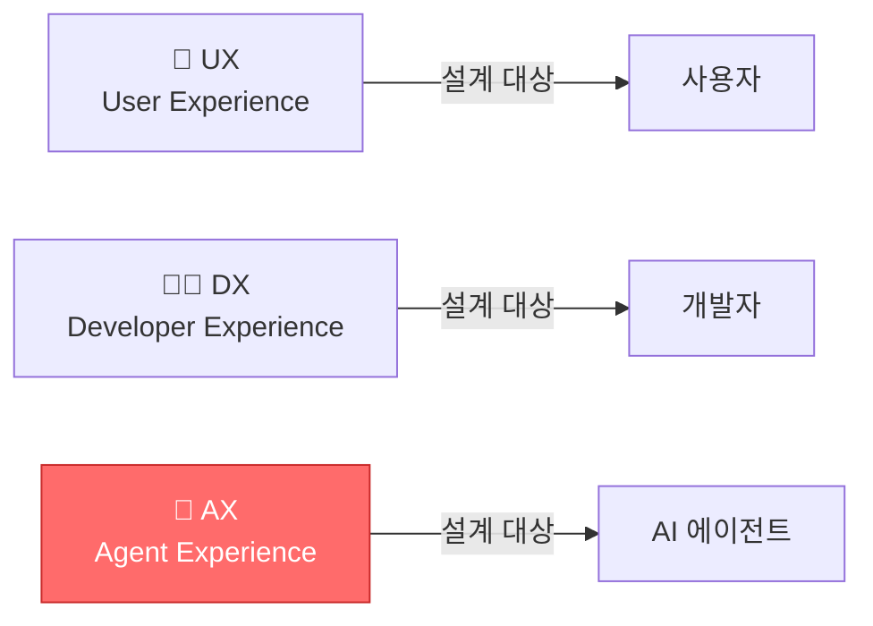
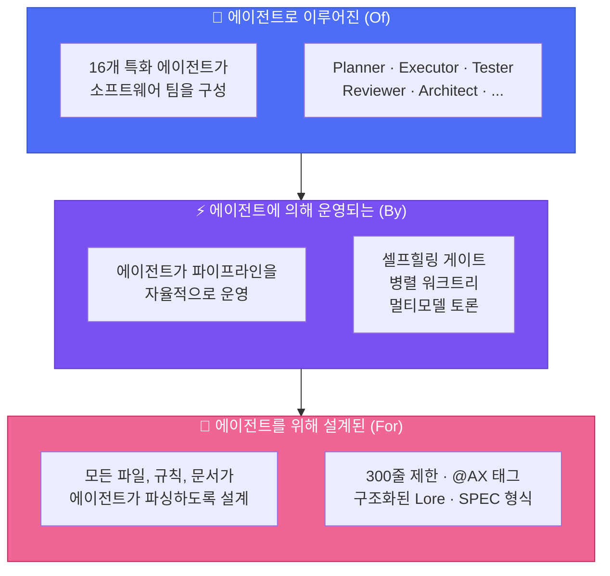
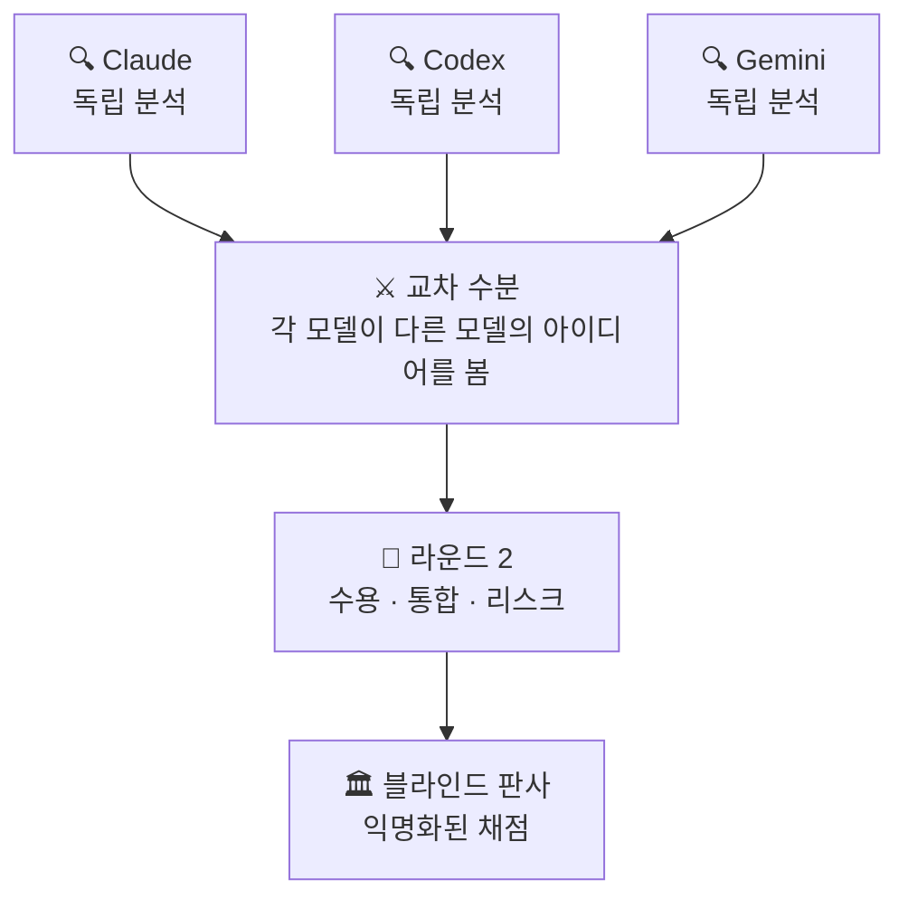
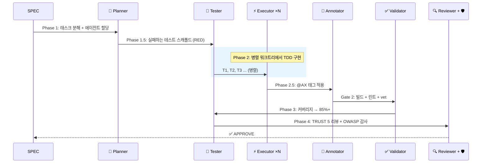
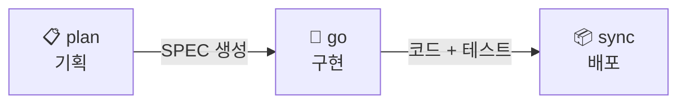

<div align="center">

# 🐙 Autopus-ADK

### 에이전트*로 이루어진*, 에이전트*에 의해 운영되는*, 에이전트*를 위한* 하네스.

**16개 에이전트. 40개 스킬. 하나의 설정. 모든 플랫폼.**

[](https://github.com/Insajin/autopus-adk/stargazers)
[](https://opensource.org/licenses/MIT)
[](https://golang.org)
[](#-하나의-설정-네-개-플랫폼)
[](#-16개-전문-에이전트)
[](#-전체-명령어)

**Claude Code, Codex 등 AI 코딩 에이전트에 아래 한 줄만 붙여넣으세요. 설치부터 설정까지 에이전트가 알아서 합니다.**

```bash
# macOS / Linux
curl -sSfL https://raw.githubusercontent.com/Insajin/autopus-adk/main/install.sh | sh

# Windows (CMD or PowerShell)
powershell -c "irm https://raw.githubusercontent.com/Insajin/autopus-adk/main/install.ps1 | iex"
```

[왜 Autopus인가](#-문제점) · [**핵심 워크플로우**](#-워크플로우) · [주요 기능](#-autopus가-다른-이유) · [파이프라인](#-파이프라인) · [보안](#-보안) · [명령어](#-전체-명령어)

[🇺🇸 English](../README.md)

</div>

---

## 🎬 실제 동작

<p align="center"></p>

```bash
# 3개 AI 모델이 서로 토론하며 브레인스토밍
/auto idea "Google과 GitHub 프로바이더로 OAuth2 인증 추가" --multi --ultrathink

# 한 명령으로 나머지 전부 — 기획, 16개 에이전트 구현, 문서화까지
/auto dev "Google과 GitHub 프로바이더로 OAuth2 인증 추가"
```

단계별 제어를 원한다면:

```bash
/auto plan "Google과 GitHub 프로바이더로 OAuth2 인증 추가" --auto --multi --ultrathink
/auto go SPEC-AUTH-001 --auto --loop --team
/auto sync SPEC-AUTH-001
```

```
🐙 Pipeline ─────────────────────────────────────────────
  ✓ Phase 1:   Planning         planner가 5개 태스크 분해
  ✓ Phase 1.5: Test Scaffold    12개 실패 테스트 생성 (RED)
  ✓ Phase 2:   Implementation   3개 executor가 병렬 워크트리에서 구현
  ✓ Phase 2.5: Annotation       8개 파일에 @AX 태그 적용
  ✓ Phase 3:   Testing          커버리지: 62% → 91%
  ✓ Phase 4:   Review           TRUST 5: APPROVE | 보안: PASS
  ───────────────────────────────────────────────────────
  ✅ 5/5 태스크 │ 91% 커버리지 │ 보안 이슈 0건 │ 4분 32초
```

> 💡 슬래시 명령 하나로. 테스트, 보안 감사, 문서, 의사결정 이력이 포함된 프로덕션 수준의 코드.

---

## 😤 문제점

AI 코딩 도구를 사용하고 계시죠. 강력합니다. 하지만...

- 🔄 **플랫폼 종속** — Claude에서 Codex로 바꾸려면? 모든 규칙과 프롬프트를 처음부터 다시 작성.
- 🎲 **희망 주도 개발** — "인증 추가해줘" → AI가 코드를 쓰고, 테스트를 건너뛰고, 보안을 무시하고, 문서를 잊음. *아마* 동작할 수도.
- 🧠 **건망증** — 다음 세션에서 AI는 모든 결정을 잊음. "왜 이 패턴을 썼지?" → 침묵.
- 👤 **솔로 에이전트** — 하나의 모델, 하나의 컨텍스트, 한 번의 기회. 다중 파일 리팩토링? 행운을 빕니다.

---

## 🧠 철학: AX — Agent Experience

> **AX**는 "AI Transformation"이 아닙니다. AX는 **Agent Experience** — AI 에이전트가 코드베이스를 인식하고, 탐색하고, 작업하는 방식입니다. UX가 사용자를 위해 설계하고 DX가 개발자를 위해 설계하듯, **AX는 에이전트를 위해 설계합니다.**



대부분의 AI 코딩 도구는 단순한 모델에 기반합니다: **당신이 지시하면, AI가 응답한다.**

Autopus는 다른 질문에서 시작합니다: *프로젝트 문서의 1차 독자가 에이전트라면?*

신입 엔지니어 온보딩을 떠올려 보세요. 빈 에디터를 주고 "인증 시스템 만들어"라고 하지 않죠. 이런 것들을 줍니다:
- 시스템을 이해할 **아키텍처 문서**
- 코드가 기존과 어울리도록 **코딩 컨벤션**
- 같은 실수를 반복하지 않도록 **의사결정 이력**
- 실수가 배포 전에 잡히도록 **리뷰 프로세스**

**AI 에이전트에게도 같은 것이 필요합니다.** 차이점은 매 세션이 첫 출근이라는 것.

Autopus는 **하네스**입니다 — 에이전트가 시니어 엔지니어가 승인할 코드를 생산하기 위해 필요한 맥락, 제약, 워크플로우를 제공하는 구조화된 환경. 희망이 아닌 설계로.

### 에이전트로. 에이전트에 의해. 에이전트를 위해.



| 원칙 | 의미 |
|------|------|
| **에이전트로 이루어진 (Of)** | 16개 특화 에이전트가 실제 엔지니어링 팀을 구성합니다 — 기획자, 구현자, 테스터, 리뷰어, 보안 감사관 등. 하나의 챗봇이 아닌 팀. |
| **에이전트에 의해 운영 (By)** | 에이전트가 파이프라인을 자율적으로 운영합니다 — 셀프힐링 품질 게이트, 병렬 워크트리, 멀티모델 토론. 사람은 목표를 설정하고, 에이전트가 실행합니다. |
| **에이전트를 위해 설계 (For)** | 모든 파일, 규칙, 문서가 에이전트가 파싱하도록 설계됩니다. 산문보다 구조. 그것이 AX입니다. |
| **매 세션이 첫 출근** | 에이전트는 세션 간 모든 맥락을 잃습니다. 하네스가 아키텍처, 의사결정, 컨벤션이라는 조직 기억을 제공합니다. |

> 🐙 **Autopus는 에이전트를 더 똑똑하게 만들지 않습니다. 더 잘 알게 만듭니다. 그것이 AX입니다.**

---

## 🔥 Autopus가 다른 이유

### 📏 에이전트가 읽을 수 있는 코드

대부분의 코드베이스는 AI를 위해 작성되지 않았습니다. 1,200줄짜리 파일은 컨텍스트 윈도우를 압도합니다. 뒤엉킨 책임은 의도를 혼란스럽게 합니다. Autopus는 모든 소스 파일에 **300줄 하드 리밋**을 강제합니다 — 미관이 아닌, **각 파일이 하나의 역할을 하고 한 번에 읽힐 때 에이전트가 더 잘 일하기 때문입니다.**

```
❌ 기존 방식:
   service.go (1,200줄) → 에이전트가 중간에서 맥락을 잃음

✅ Autopus 방식:
   service.go       (180줄)  핸들러 로직
   service_auth.go  (120줄)  인증 미들웨어
   service_repo.go  (150줄)  데이터 접근
   → 모든 파일이 하나의 컨텍스트 윈도우에 들어갑니다. 모든 파일이 하나의 역할을 합니다.
```

이것은 단순히 파일 크기만의 문제가 아닙니다. 전체 하네스가 **설계 단계부터 에이전트가 읽기 쉽게** 만들어져 있습니다:

| 레이어 | 에이전트 친화적 설계 |
|--------|---------------------|
| **규칙** | IMPORTANT 마커가 포함된 구조화된 마크다운 — 에이전트가 파싱합니다 |
| **스킬** | 트리거가 있는 YAML 프론트매터 — 에이전트가 적절한 스킬을 자동 활성화 |
| **문서** | 문단 대신 표, 산문 대신 체크리스트 — 읽히는 게 아니라 파싱됩니다 |
| **코드** | ≤ 300줄, 단일 책임, 관심사별 분리 — 하나의 컨텍스트에 담깁니다 |

> 🐙 **사람이 읽기 좋은 것은 보너스입니다. 에이전트가 읽을 수 있는 것이 요구사항입니다.**

### 🤖 챗봇이 아닌, 팀을 구성하는 AI 에이전트

Autopus는 하나의 AI 어시스턴트가 아닌 — 역할 정의, 품질 게이트, 재시도 로직을 갖춘 **16개 전문 에이전트 소프트웨어 엔지니어링 팀**을 제공합니다.

```
🧠 Planner        →  요구사항을 태스크로 분해
⚡ Executor ×N    →  병렬 워크트리에서 코드 구현
🧪 Tester         →  코드 작성 전에 테스트 먼저 (TDD 강제)
✅ Validator       →  빌드, 린트, vet 검사
🔍 Reviewer       →  TRUST 5 코드 리뷰
🛡️ Security       →  OWASP Top 10 보안 감사
📝 Annotator      →  @AX 태그로 코드 문서화
🏗️ Architect      →  시스템 설계 결정
🔬 Deep Worker    →  장시간 자율 탐색 + 구현
... 외 7개
```

### ⚔️ AI 모델들이 서로 토론한다 (`--multi`)

하나의 모델에는 맹점이 있습니다. **세 모델이 서로의 실수를 잡습니다.**

모든 AI 모델에는 고유한 강점과 편향이 있습니다 — Claude는 꼼꼼하지만 장황하고, Codex는 빠르지만 때로 얕고, Gemini는 완전히 다른 시각을 가져옵니다. `--multi`를 사용하면 단순히 병렬 실행되는 게 아니라 — **서로의 아이디어를 리뷰하고, 도전하고, 발전시킵니다.**

```bash
# 어떤 명령에든 --multi를 추가하면 멀티 모델 지능이 활성화
/auto idea "새 기능" --multi          # 3개 모델 브레인스토밍 → 교차 수분 → ICE 점수
/auto plan "새 기능" --multi          # 3개 모델이 독립적으로 SPEC 리뷰
/auto go SPEC-ID --multi              # 3개 모델이 코드 리뷰 토론
```



**왜 중요한가:**
- Claude가 놓치는 버그를 Codex가 잡고, Codex가 무시하는 엣지 케이스를 Gemini가 지적합니다.
- 하나의 모델이라면 절대 생각하지 못할 아이디어가 교차 수분에서 나옵니다.
- 블라인드 판사가 익명화된 결과를 채점합니다 — 모델 편향 없음.
- 연구에 따르면 멀티 에이전트 토론이 단일 모델보다 높은 품질의 결과를 냅니다.

> **`/auto dev`는 `--multi`를 기본 활성화합니다.** 모든 기획이 멀티 모델 리뷰를 거칩니다. 모든 코드 리뷰가 교차 검증됩니다. 신경 쓸 필요 없습니다.

4가지 전략: **Consensus** (합의 병합) · **Debate** (적대적 리뷰 + 판사) · **Pipeline** (출력 체이닝) · **Fastest** (최초 완료 우선)

### 🔁 자가 치유 파이프라인 (RALF 루프)

품질 게이트는 실패만 하지 않습니다 — **스스로 고치고 재시도합니다.**

```bash
/auto go SPEC-AUTH-001 --auto --loop
```

```
🐙 RALF [Gate 2] ──────────────────
  Iteration: 1/5 │ Issues: 3
  → golangci-lint 경고 수정을 위해 executor 스폰 중...

🐙 RALF [Gate 2] ──────────────────
  Iteration: 2/5 │ Issues: 3 → 0
  Status: PASS ✅
```

**RALF = RED → GREEN → REFACTOR → LOOP** — TDD 원칙을 파이프라인 자체에 적용. 내장 서킷 브레이커가 무한 루프를 방지합니다.

### 🌳 격리된 워크트리에서 병렬 에이전트 실행

여러 executor가 **동시에** 작업합니다 — 각각 자체 git 워크트리에서. 충돌 없음. 손상 없음.

```
Phase 2: Implementation
  ├── ⚡ Executor 1 (worktree/T1) → pkg/auth/provider.go     ✓
  ├── ⚡ Executor 2 (worktree/T2) → pkg/auth/handler.go      ✓
  └── ⚡ Executor 3 (worktree/T3) → pkg/auth/middleware.go    ✓

Phase 2.1: Merge (태스크 ID 순서)
  ✓ T1 병합 → T2 병합 → T3 병합 → 작업 브랜치
```

파일 소유권으로 충돌 방지. GC 억제로 손상 방지. 최대 **5개 동시 워크트리.**

### 📜 Lore: 코드베이스는 절대 잊지 않는다

모든 커밋이 what이 아닌 **why**를 기록합니다. 영원히 조회 가능.

```
feat(auth): OAuth2 프로바이더 추상화 추가

Why: Google + GitHub 지원이 필요하고, 향후 프로바이더 확장 가능해야 함
Decision: 직접 SDK 사용 대신 인터페이스 기반 추상화
Alternatives: 직접 SDK 호출 (거부: 결합도 높음)
Ref: SPEC-AUTH-001

🐙 Autopus <noreply@autopus.co>
```

9개 구조화된 트레일러. `auto lore query "왜 인터페이스?"`로 조회. 90일 지난 결정은 자동 감지.

### 🧪 자율 실험 루프

AI가 자율적으로 반복합니다 — 측정하고, 유지 또는 폐기하고, 반복합니다.

```bash
/auto experiment --metric "go test -bench=BenchmarkProcess" --direction lower --max-iter 5
```

```
🐙 Experiment ───────────────────────
  Iter 1: baseline  │ 1200 ns/op
  Iter 2: optimize  │  850 ns/op  ✓ keep (29% improvement)
  Iter 3: refactor  │  900 ns/op  ✗ discard (regression)
  Iter 4: cache     │  620 ns/op  ✓ keep (27% improvement)
  ─────────────────────────────────────
  Result: 1200 → 620 ns/op (48% improvement)
```

내장 **서킷 브레이커**로 무한 반복을 방지합니다. **단순성 점수**가 과도하게 복잡한 솔루션에 패널티를 부여합니다. 각 반복은 git 커밋으로 기록되어 리뷰 및 롤백이 용이합니다.

> **상태: 실험적** — CLI 명령어(`auto experiment`)는 사용 가능하지만 스킬 레벨 통합은 진행 중입니다. 핵심 반복 루프는 작동하며, 전체 파이프라인 통합은 준비 중입니다.

### 🧠 실패에서 배우는 파이프라인

Autopus 파이프라인은 단순히 실패하지 않습니다 — **왜 실패했는지 기억하고** 다음에 같은 실수를 방지합니다.

```
Gate 2 FAIL: golangci-lint — pkg/auth/에서 미사용 변수
→ .autopus/learnings/pipeline.jsonl에 자동 기록
→ 다음 /auto go: 학습 내용이 executor 프롬프트에 주입
→ 같은 실수 반복 없음
```

모든 파이프라인 실패가 구조화된 학습 항목으로 기록됩니다. 다음 실행 시 관련 학습이 자동으로 에이전트 프롬프트에 주입되어 — 세션을 넘어선 **조직 기억**을 파이프라인에 부여합니다.

### 🏥 배포 후 헬스 체크

먼저 배포하고, 즉시 검증합니다. `canary`는 빌드 검증, E2E 테스트, 브라우저 헬스 체크를 라이브 배포에 대해 실행합니다.

```bash
/auto canary                          # 빌드 + E2E + 브라우저 자동 검증
/auto canary --url https://myapp.com  # 특정 배포 URL 대상
/auto canary --watch 5m               # 5분마다 반복
/auto canary --compare                # 이전 카나리 리포트와 비교
```

빌드 상태, 테스트 결과, 접근성 점수, 스크린샷 diff가 포함된 `canary.md` 진단 보고서를 생성합니다.

### 🔀 스마트 모델 라우팅

모든 태스크에 Opus가 필요하지 않습니다. Autopus가 메시지 복잡도를 분석하고 적절한 모델로 자동 라우팅합니다.

```
단순 질의     → Haiku  (빠르고 저렴)
코드 리뷰     → Sonnet (균형)
아키텍처      → Opus   (깊은 추론)
```

설정 불필요 — 라우터가 토큰 수, 코드 복잡도, 도메인 신호를 평가하여 최적 모델을 선택합니다. `--quality ultra`로 언제든 오버라이드 가능.

### 🔌 프로바이더 연결 마법사

AI 프로바이더 설정에 문서를 읽을 필요 없습니다. `auto connect`가 3단계 가이드 설정을 안내합니다.

```bash
auto connect    # 대화형 마법사: 감지 → 설정 → 검증
```

설치된 CLI 도구를 감지하고, API 키를 검증하고, 연결을 테스트하고, 프로바이더 설정을 작성합니다 — 모두 한 명령으로.

### 🤖 ADK Worker — 로컬 에이전트 실행

Autopus CLI와 Autopus 플랫폼 간의 브릿지입니다. ADK Worker는 A2A + MCP 하이브리드 태스크를 로컬에서 실행하여, 클라우드 의존 없이 플랫폼급 오케스트레이션을 가능하게 합니다.

### 💰 반복 예산 관리

Worker가 영원히 실행되지 않습니다. 각 executor에 도구 호출 예산이 할당되어 — 복잡한 태스크를 완료할 충분한 여유를 보장하면서 폭주 에이전트를 방지합니다.

### 📦 컨텍스트 압축

파이프라인이 단계를 진행하면서 이전 컨텍스트가 자동으로 압축됩니다 — 중요한 정보를 잃지 않으면서 에이전트 프롬프트를 집중적이고 토큰 한도 내로 유지합니다.

### 🔄 죽지 않는 파이프라인

파이프라인 중간에 크래시? 마지막 체크포인트에서 정확히 재개합니다.

```bash
/auto go SPEC-AUTH-001 --continue    # 마지막 체크포인트에서 재개
```

YAML 기반 체크포인트가 매 단계 후 파이프라인 상태를 저장합니다. Stale 감지가 오래된 세션 재개를 방지합니다. `--auto --loop`과 결합하면 **완전 복원력 있는 자율 파이프라인**을 얻습니다.

### 🧪 코드에서 E2E 시나리오 자동 생성

E2E 테스트 시나리오를 자동 생성하고 실행합니다 — 수동 테스트 작성 불필요.

```bash
auto test run                    # 모든 시나리오 실행
auto test run -s init --verbose  # 특정 시나리오 실행
```

Autopus가 코드베이스(Cobra 커맨드, API 라우트, 프론트엔드 페이지)를 분석하여 **검증 프리미티브** (`exit_code`, `stdout_contains`, `status_code`, `json_path` 등)가 포함된 타입 시나리오를 생성합니다. 증분 동기화로 코드 변경에 따라 시나리오가 자동 갱신됩니다.

### 🔧 더 많은 도구

| 기능 | 명령어 | 설명 |
|------|--------|------|
| **Reaction Engine** | `auto react check/apply` | CI 실패 감지, 로그 분석, 수정 보고서 자동 생성 |
| **Meta-Agent Builder** | `auto agent create` / `auto skill create` | 패턴 기반 커스텀 에이전트/스킬 스캐폴드 생성 |
| **Hard Gate** | `auto check --gate` | 파이프라인 게이트 강제 (mandatory/advisory 모드) |
| **Self-Update** | `auto update --self` | 원자적 바이너리 업데이트 — GitHub Releases 확인 + SHA256 검증 |
| **비용 추적** | `auto telemetry cost` | 모델별 토큰 기반 파이프라인 비용 추정 |
| **이슈 리포터** | `auto issue report` | 에러 컨텍스트 자동 수집, 시크릿 정제, GitHub 이슈 생성 |
| **시그니처 맵** | `auto setup` | AST 분석으로 exported API 시그니처 추출 (Go + TypeScript) |
| **테스트 러너 감지** | `auto init` | jest, vitest, pytest, cargo 테스트 프레임워크 자동 감지 |

### 🌐 하나의 설정, 네 개 플랫폼

```bash
auto init   # 설치된 모든 AI 코딩 CLI 자동 감지
```

하나의 `autopus.yaml`이 감지된 모든 플랫폼에 **네이티브 설정**을 생성합니다.

| 플랫폼 | 생성되는 파일 |
|--------|-------------|
| **Claude Code** | `.claude/rules/`, `.claude/skills/`, `.claude/agents/`, `CLAUDE.md` |
| **Codex** | `.codex/`, `AGENTS.md` |
| **Gemini CLI** | `.gemini/`, `GEMINI.md` |
| **OpenCode** | `opencode.json`, plugins |

동일한 16개 에이전트. 동일한 40개 스킬. 동일한 규칙. **모든 플랫폼.**

---

## 🚀 빠른 시작 가이드

5분 안에 첫 AI 기반 기능을 만들어 보세요.

### 1단계 · 설치 및 초기화 (한 줄)

> **에이전트에게 한 줄만 복사해서 주면 됩니다.** 바이너리 다운로드, 플랫폼 감지, `auto init`까지 자동으로 처리합니다. 수동 설정 불필요 — 에이전트가 알아서 합니다.

```bash
# macOS / Linux — 바이너리 설치 + 프로젝트 자동 초기화
cd your-project
curl -sSfL https://raw.githubusercontent.com/Insajin/autopus-adk/main/install.sh | sh

# Windows (CMD or PowerShell)
cd your-project
powershell -c "irm https://raw.githubusercontent.com/Insajin/autopus-adk/main/install.ps1 | iex"
```

<details>
<summary>기타 설치 방법</summary>

```bash
# go install (Go 1.26+ 필요)
go install github.com/Insajin/autopus-adk/cmd/auto@latest

# 소스에서 빌드
git clone https://github.com/Insajin/autopus-adk.git
cd autopus-adk && make build && make install
```

</details>

### 2단계 · 프로젝트 초기화

```bash
cd your-project
auto init
```

`auto init`은 설치된 AI 코딩 CLI(Claude Code, Codex, Gemini CLI)를 자동 감지하고, 각 플랫폼에 맞는 **네이티브 설정** — 규칙, 스킬, 에이전트 — 을 하나의 `autopus.yaml`에서 생성합니다.

```
✓ 감지됨: claude-code, gemini-cli
✓ 생성됨: .claude/rules/, .claude/skills/, .claude/agents/, CLAUDE.md
✓ 생성됨: .gemini/, GEMINI.md
✓ 생성됨: autopus.yaml
```

### 3단계 · 프로젝트 컨텍스트 생성 (`/auto setup`)

**가장 중요한 단계입니다.** AI 에이전트는 세션 간 모든 기억을 잃습니다 — 매번 프로젝트를 처음 보는 것과 같습니다. `/auto setup`은 에이전트가 프로젝트를 즉시 이해할 수 있게 해주는 "온보딩 문서"를 생성합니다.

```bash
auto setup      # CLI에서
/auto setup     # AI 코딩 CLI 내부에서 (예: Claude Code)
```

코드베이스를 분석하여 5개의 컨텍스트 문서를 생성합니다:

```
ARCHITECTURE.md                    # 도메인, 레이어, 의존성 맵
.autopus/project/product.md       # 프로젝트 설명, 핵심 기능
.autopus/project/structure.md     # 디렉토리 구조, 패키지 역할, 엔트리포인트
.autopus/project/tech.md          # 기술 스택, 빌드, 테스트 전략
.autopus/project/scenarios.md     # 코드에서 추출된 E2E 테스트 시나리오
```

> 💡 **왜 중요한가요?** 이 문서 없이 AI가 프로젝트를 보는 것은, 온보딩 없이 첫 출근한 신입사원과 같습니다 — 아키텍처를 추측하고, 컨벤션을 놓치고, 이미 존재하는 패턴을 다시 만들게 됩니다. `/auto setup`으로 모든 에이전트 세션이 정보를 갖고 시작합니다.

### 4단계 · 첫 기능 만들기

준비 완료. 원하는 것을 자연어로 설명하세요:

```bash
# 1. 기획 — AI가 전체 SPEC 생성 (요구사항, 태스크, 수락 기준)
/auto plan "GET /healthz 헬스 체크 엔드포인트 추가"

# 2. 구현 — 16개 에이전트가 구현, 테스트, 리뷰 처리
/auto go SPEC-HEALTH-001 --auto

# 3. 배포 — 문서 동기화, SPEC 상태 업데이트, 의사결정 이력과 함께 커밋
/auto sync SPEC-HEALTH-001
```

```
╭────────────────────────────────────╮
│ 🐙 파이프라인 완료!                 │
│ SPEC-HEALTH-001: 헬스 체크          │
│ 태스크: 3/3 │ 커버리지: 92%         │
│ 리뷰: APPROVE                      │
╰────────────────────────────────────╯
```

이게 전부입니다 — 테스트, 보안 감사, 완전한 문서화가 포함된 프로덕션 수준 코드가 세 개의 명령으로 완성됩니다.

### 빠른 참조

| 하고 싶은 것 | 명령어 |
|-------------|--------|
| **아이디어 브레인스토밍** | `/auto idea "설명" --multi --ultrathink` |
| **풀 사이클 (추천)** | `/auto dev "설명"` |
| 새 기능 기획 | `/auto plan "설명"` |
| SPEC 구현 | `/auto go SPEC-ID --auto --loop --team` |
| 버그 수정 (SPEC 불필요) | `/auto fix "설명"` |
| 자연어로 설명만 | `/auto 로그인 페이지에 2FA 추가` |
| 배포 후 헬스 체크 | `/auto canary` |
| 코드 리뷰 | `/auto review` |
| 보안 감사 | `/auto secure` |
| 중단된 파이프라인 재개 | `/auto go SPEC-ID --continue` |
| 변경 후 문서 동기화 | `/auto sync SPEC-ID` |

### 업데이트

Autopus-ADK는 두 가지 업데이트가 있습니다:

**1. 바이너리 업데이트** — `auto` CLI 자체를 최신 버전으로:

```bash
auto update --self
```

GitHub Releases에서 최신 버전을 확인하고, SHA256 체크섬 검증 후 바이너리를 교체합니다. 현재 버전은 `auto version`으로 확인하세요.

**2. 하네스 업데이트** — 프로젝트의 규칙/스킬/에이전트를 최신 템플릿으로:

```bash
auto update
```

`.claude/rules/`, `.claude/skills/`, `.claude/agents/` 등의 하네스 파일을 갱신합니다. `AUTOPUS:BEGIN`~`AUTOPUS:END` 마커 바깥의 사용자 편집은 보존됩니다. 새로 설치된 플랫폼이 있으면 자동 감지하여 해당 파일도 생성합니다.

**한 줄로 둘 다:**

```bash
auto update --self && auto update
```

> **언제 업데이트?** 새 버전이 릴리즈되면 `auto update --self`, 그 다음 `auto update`로 프로젝트에 새 규칙/스킬/에이전트를 반영하세요.

### 일반적인 시나리오

<details>
<summary><strong>"버그를 수정하고 싶어요"</strong></summary>

```bash
/auto fix "로그인 페이지에서 500 에러"
```

에이전트가 자동으로:
1. 재현 테스트 작성 (실패 확인)
2. 근본 원인 분석
3. 최소한의 수정 적용
4. 모든 테스트 통과 확인

SPEC 불필요 — 즉시 실행.
</details>

<details>
<summary><strong>"새 기능을 추가하고 싶어요"</strong></summary>

```bash
# 작은 기능 — SPEC만, PRD 생략
/auto plan "GET /healthz 헬스 체크 엔드포인트 추가" --skip-prd

# 큰 기능 — 전체 PRD + SPEC
/auto plan "OAuth2 Google + GitHub 프로바이더 지원"

# 아이디어부터 탐색 — 멀티 프로바이더 브레인스토밍
/auto idea "마이크로서비스로 전환해야 할까?" --multi
```

`/auto idea`는 ICE 채점(Impact, Confidence, Ease)과 멀티 프로바이더 브레인스토밍을 실행하고, BS 파일을 생성하며, `/auto plan`으로 직접 연결할 수 있습니다.
</details>

<details>
<summary><strong>"코드 리뷰를 받고 싶어요"</strong></summary>

```bash
/auto review                    # 현재 변경사항 TRUST 5 리뷰
/auto secure                    # OWASP Top 10 보안 스캔
/auto review --multi            # 멀티 모델 교차 리뷰 (토론 전략)
```
</details>

<details>
<summary><strong>"그냥 자연어로 설명하고 싶어요"</strong></summary>

```bash
/auto 로그인 페이지에 2FA 추가
```

Autopus Triage가 자동으로 요청을 분석합니다:
- 복잡도 평가 (LOW / MEDIUM / HIGH)
- 영향 범위 스캔
- 추천 워크플로우 (fix / plan / idea)

```
🐙 Triage ────────────────────────────
  Request: "로그인 페이지에 2FA 추가"
  Complexity: HIGH → /auto idea --multi (추천)
```

슬래시 서브커맨드 불필요 — `/auto` 뒤에 원하는 것을 설명하면 됩니다.
</details>

### 🔄 업데이트

Autopus-ADK는 두 가지 업데이트가 있습니다:

**1. 바이너리 업데이트** — `auto` CLI 자체를 최신 버전으로:

```bash
auto update --self
```

- GitHub Releases에서 최신 버전을 확인하고 SHA256 체크섬 검증 후 교체
- 현재 버전: `auto version`으로 확인

**2. 하네스 업데이트** — 프로젝트의 규칙/스킬/에이전트 파일을 최신으로:

```bash
auto update
```

- `.claude/rules/`, `.claude/skills/`, `.claude/agents/` 등의 하네스 파일을 최신 템플릿으로 갱신
- 사용자가 직접 수정한 내용은 마커(`AUTOPUS:BEGIN`~`AUTOPUS:END`) 바깥이면 보존됨
- 새 플랫폼이 설치되었으면 자동 감지하여 해당 플랫폼 파일도 생성

**언제 업데이트해야 하나요?**

| 명령어 | 시점 |
|--------|------|
| `auto update --self` | 새 기능이 릴리즈되었을 때 (릴리즈 노트 확인) |
| `auto update` | 바이너리 업데이트 후, 새 규칙/스킬/에이전트가 프로젝트에 반영되도록 |

**한 줄로 둘 다:**

```bash
auto update --self && auto update
```

---

## 🤖 파이프라인

### 7단계 멀티 에이전트 파이프라인

모든 `/auto go`가 이 파이프라인을 실행합니다:



### 16개 전문 에이전트

| 에이전트 | 역할 | 실행 시점 |
|---------|------|----------|
| **Planner** | SPEC 분해, 태스크 할당, 복잡도 평가 | Phase 1 |
| **Spec Writer** | spec.md, plan.md, acceptance.md, research.md 생성 | `/auto plan` |
| **Tester** | 테스트 스캐폴드 (RED) + 커버리지 부스트 (GREEN) | Phase 1.5, 3 |
| **Executor** | 병렬 워크트리에서 TDD 구현 | Phase 2 |
| **Annotator** | @AX 태그 라이프사이클 관리 | Phase 2.5 |
| **Validator** | 빌드, vet, 린트, 파일 크기 검사 | Gate 2 |
| **Reviewer** | TRUST 5 코드 리뷰 | Phase 4 |
| **Security Auditor** | OWASP Top 10 취약점 스캔 | Phase 4 |
| **Architect** | 시스템 설계, 아키텍처 결정 | 온디맨드 |
| **Debugger** | 재현 우선 버그 수정 | `/auto fix` |
| **DevOps** | CI/CD, Docker, 인프라 | 온디맨드 |
| **Frontend Specialist** | Playwright E2E + VLM 시각적 회귀 감지 | Phase 3.5 |
| **UX Validator** | 프론트엔드 컴포넌트 시각적 검증 | Phase 3.5 |
| **Perf Engineer** | 벤치마크, pprof, 성능 회귀 감지 | 온디맨드 |
| **Deep Worker** | 장시간 자율 탐색 + 구현 | 온디맨드 |
| **Explorer** | 코드베이스 구조 분석 | `/auto map` |

### 품질 모드

```bash
/auto go SPEC-ID --quality ultra      # 모든 에이전트를 Opus로 — 최고 품질
/auto go SPEC-ID --quality balanced   # 적응형: 태스크 복잡도별 Opus/Sonnet/Haiku
```

| 모드 | Planner | Executor | Validator | 비용 |
|------|---------|----------|-----------|------|
| **Ultra** | Opus | Opus | Opus | $$$ |
| **Balanced** | Opus | 적응형* | Haiku | $ |

\* HIGH 복잡도 → Opus · MEDIUM → Sonnet · LOW → Haiku

### 실행 모드

| 플래그 | 모드 | 설명 |
|--------|------|------|
| *(기본)* | 서브에이전트 파이프라인 | 메인 세션이 Agent() 호출 오케스트레이션 |
| `--team` | Agent Teams | Lead / Builder / Guardian 역할 기반 팀 |
| `--solo` | 단일 세션 | 서브에이전트 없이 직접 TDD |
| `--auto --loop` | 완전 자율 | RALF 자가 치유, 사용자 승인 없음 |
| `--multi` | 멀티 프로바이더 | 여러 모델로 토론/합의 리뷰 |

---

## 📐 워크플로우

### 빠른 경로 — 두 개의 명령

대부분의 기능에는 두 개의 명령만 필요합니다:

```bash
# 1. 브레인스토밍 — 멀티 프로바이더 토론 + 깊은 분석
/auto idea "재시도와 데드 레터 큐를 갖춘 웹훅 전송 추가" --multi --ultrathink

# 2. 빌드 & 배포 — 전체 자율 파이프라인
/auto dev "재시도와 데드 레터 큐를 갖춘 웹훅 전송 추가"
```

`/auto idea`는 멀티 프로바이더 브레인스토밍(Claude x Codex x Gemini 토론)을 딥 순차 사고와 함께 실행하고, ICE로 아이디어를 채점하고, 결과를 저장합니다.

`/auto dev`는 나머지를 처리합니다 — **plan → go → sync**를 한 번에, 모든 파워 플래그가 기본 활성화:

| 단계 | 수행 내용 | 플래그 (자동 적용) |
|------|----------|-------------------|
| **plan** | PRD + SPEC + 멀티 프로바이더 리뷰 | `--auto --multi --ultrathink` |
| **go** | 16개 에이전트 Agent Teams + 자가 치유 | `--auto --loop --team` |
| **sync** | 문서 + 변경 이력 + Lore 커밋 | — |

> 풀 파워가 필요 없다면? `--solo`로 단일 세션 모드, `--no-multi`로 멀티 프로바이더 리뷰 생략, 또는 `plan` / `go` / `sync`를 개별 실행하여 세밀하게 제어하세요.

### 수동 경로 — 세 개의 명령

더 세밀한 제어를 원한다면, 각 단계를 별도로 실행하세요:



### 📋 1단계 · `/auto plan` — 원하는 것을 설명하세요

자연어 설명을 완전한 **SPEC**으로 변환합니다 — 요구사항, 태스크, 수락 기준, 리스크 분석까지.

```bash
/auto plan "재시도와 데드 레터 큐를 갖춘 웹훅 전송 추가"
```

spec-writer 에이전트가 5개 문서를 생성합니다:

```
.autopus/specs/SPEC-HOOK-001/
├── prd.md          # 제품 요구사항 문서
├── spec.md         # EARS 형식 요구사항
├── plan.md         # 태스크 분해 + 에이전트 할당
├── acceptance.md   # Given-When-Then 수락 기준
└── research.md     # 기술 조사 + 리스크
```

옵션: `--multi` 멀티 프로바이더 리뷰 · `--prd-mode minimal` 경량 PRD · `--skip-prd` PRD 건너뛰고 바로 SPEC

### 🚀 2단계 · `/auto go` — 구현하기

SPEC을 **16개 에이전트**에 전달합니다. 기획, 테스트 스캐폴드, 병렬 구현, 검증, 어노테이션, 테스트, 리뷰까지 — 모두 자동으로.

```bash
/auto go SPEC-HOOK-001 --auto --loop
```

```
Phase 1    │ 🧠 Planner         │ SPEC → 태스크 + 에이전트 할당
Phase 1.5  │ 🧪 Tester          │ 실패하는 테스트 스켈레톤 (RED)
Phase 2    │ ⚡ Executor ×N      │ 병렬 워크트리에서 TDD
Phase 2.5  │ 📝 Annotator       │ @AX 문서화 태그
Gate  2    │ ✅ Validator        │ 빌드 + 린트 + vet
Phase 3    │ 🧪 Tester          │ 커버리지 → 85%+
Phase 4    │ 🔍 Reviewer + 🛡️    │ TRUST 5 + OWASP 감사
```

옵션: `--team` Agent Teams · `--solo` 단일 세션 TDD · `--quality ultra` 전체 Opus 실행 · `--multi` 멀티 모델 리뷰

### 📦 3단계 · `/auto sync` — 배포하고 문서화하기

SPEC 상태 업데이트, 프로젝트 문서 재생성, @AX 태그 라이프사이클 관리, 구조화된 Lore 이력으로 커밋.

```bash
/auto sync SPEC-HOOK-001
```

```
╭────────────────────────────────────╮
│ 🐙 파이프라인 완료!                 │
│ SPEC-HOOK-001: 웹훅 전송           │
│ 태스크: 5/5 │ 커버리지: 91%         │
│ 리뷰: APPROVE                      │
╰────────────────────────────────────╯
```

**끝입니다.** 세 개의 명령: 기획 → 구현 → 배포. 모든 결정이 기록됩니다. 모든 테스트가 강제됩니다.

---

## 🎯 TRUST 5 코드 리뷰

모든 리뷰는 5개 차원으로 평가됩니다:

| | 차원 | 검사 항목 |
|---|------|----------|
| **T** | Tested (테스트) | 85%+ 커버리지, 엣지 케이스, `go test -race` |
| **R** | Readable (가독성) | 명확한 네이밍, 단일 책임, ≤ 300 LOC |
| **U** | Unified (일관성) | gofmt, goimports, golangci-lint, 일관된 패턴 |
| **S** | Secured (보안) | OWASP Top 10, 인젝션 없음, 하드코딩된 시크릿 없음 |
| **T** | Trackable (추적성) | 의미 있는 로그, 에러 컨텍스트, SPEC/Lore 참조 |

---

## 📊 멀티 모델 오케스트레이션

| 전략 | 작동 방식 | 적합한 용도 |
|------|----------|------------|
| **🤝 Consensus** | 독립 응답을 키 합의로 병합 | 기획, 코드 리뷰 |
| **⚔️ Debate** | 2단계 토론 + 판사 판정 | 중요 결정, 보안 |
| **🔗 Pipeline** | N번째 출력 → N+1번째 입력 | 반복 정제 |
| **⚡ Fastest** | 가장 먼저 완료된 응답 사용 | 빠른 질문 |

프로바이더: **Claude** · **Codex** · **Gemini** · **OpenCode** — 그레이스풀 디그레이드 지원.

**인터랙티브 토론**을 실시간 창 시각화(cmux/tmux)로. **훅 기반 결과 수집**으로 구조화된 JSON 출력. Context7 문서 불가 시 **WebSearch 폴백**.

---

## 📖 전체 명령어

<details>
<summary><strong>CLI 명령어</strong> (루트 28개, 서브커맨드 포함 110개 이상)</summary>

| 명령어 | 설명 |
|--------|------|
| `auto init` | 하네스 초기화 — 플랫폼 감지, 파일 생성 |
| `auto update` | 하네스 업데이트 (마커 기반, 사용자 편집 보존) |
| `auto doctor` | 상태 진단 |
| `auto platform` | 플랫폼 관리 (list / add / remove) |
| `auto arch` | 아키텍처 분석 (generate / enforce) |
| `auto spec` | SPEC 관리 (new / validate / review) |
| `auto lore` | 의사결정 추적 (context / commit / validate / stale) |
| `auto orchestra` | 멀티 모델 오케스트레이션 (review / plan / secure / brainstorm / job-status / job-wait / job-result) |
| `auto setup` | 프로젝트 컨텍스트 문서 (generate / update / validate / status) |
| `auto status` | SPEC 대시보드 (done / in-progress / draft) |
| `auto telemetry` | 파이프라인 텔레메트리 (record / summary / cost / compare) |
| `auto skill` | 스킬 관리 (list / info / create) |
| `auto search` | 지식 검색 (Exa) |
| `auto docs` | 라이브러리 문서 조회 (Context7) |
| `auto lsp` | LSP 연동 (diagnostics / refs / rename / symbols / definition) |
| `auto verify` | 프론트엔드 UX 검증 (Playwright + VLM) |
| `auto check` | 하네스 규칙 검사 (안티패턴 스캔) |
| `auto hash` | 파일 해싱 (xxhash) |
| `auto issue` | 자동 이슈 리포터 (report / list / search) |
| `auto experiment` | 자율 실험 루프 (init / metric / record / commit / reset / summary / status) |
| `auto test` | E2E 시나리오 실행기 (run) |
| `auto react` | Reaction Engine (check / apply) |
| `auto agent` | 에이전트 관리 (create / run) |
| `auto terminal` | 터미널 멀티플렉서 관리 (detect / workspace / split / send / notify) |
| `auto pipeline` | 파이프라인 상태 관리 및 모니터링 |
| `auto permission` | 권한 모드 감지 (bypass / safe) |
| `auto browse` | 브라우저 자동화 (cmux browser / agent-browser) |
| `auto canary` | 배포 후 헬스 체크 (빌드 + E2E + 브라우저) |
| `auto connect` | 프로바이더 연결 마법사 (감지 → 설정 → 검증) |
| `auto update --self` | CLI 바이너리 자동 업데이트 (GitHub Releases + SHA256) |

</details>

<details>
<summary><strong>슬래시 명령어</strong> (AI 코딩 CLI 내부)</summary>

| 명령어 | 설명 |
|--------|------|
| `/auto plan "설명"` | 새 기능의 SPEC 작성 |
| `/auto go SPEC-ID` | 전체 파이프라인으로 구현 |
| `/auto go SPEC-ID --auto --loop` | 완전 자율 + 자가 치유 |
| `/auto go SPEC-ID --team` | Agent Teams (Lead/Builder/Guardian) |
| `/auto go SPEC-ID --multi` | 멀티 프로바이더 오케스트레이션 |
| `/auto fix "버그"` | 재현 우선 버그 수정 |
| `/auto review` | TRUST 5 코드 리뷰 |
| `/auto secure` | OWASP Top 10 보안 감사 |
| `/auto map` | 코드베이스 구조 분석 |
| `/auto sync SPEC-ID` | 구현 후 문서 동기화 |
| `/auto dev "설명"` | 풀 파워: plan(--multi --ultrathink) → go(--team --loop) → sync |
| `/auto setup` | 프로젝트 컨텍스트 문서 생성/업데이트 |
| `/auto stale` | 오래된 결정 및 패턴 감지 |
| `/auto why "질문"` | 의사결정 근거 조회 |
| `/auto experiment` | 자율 실험 루프 (메트릭 기반 반복) |
| `/auto test` | 프로젝트 E2E 시나리오 실행 |
| `/auto go SPEC-ID --continue` | 중단된 파이프라인 체크포인트에서 재개 |
| `/auto browse` | 브라우저 자동화 — 열기, 스냅샷, 클릭, 검증 |
| `/auto idea "설명"` | 멀티 프로바이더 브레인스토밍 + ICE 채점 |
| `/auto canary` | 배포 후 헬스 체크 (빌드 + E2E + 브라우저) |

</details>

---

## ⚙️ 설정

<details>
<summary><strong><code>autopus.yaml</code></strong> — 모든 것을 위한 단일 설정</summary>

```yaml
mode: full                    # full 또는 lite
project_name: my-project
platforms:
  - claude-code

architecture:
  auto_generate: true
  enforce: true

lore:
  enabled: true
  required_trailers: [Why, Decision]
  stale_threshold_days: 90

spec:
  review_gate:
    enabled: true
    strategy: debate
    providers: [claude, gemini]
    judge: claude

methodology:
  mode: tdd
  enforce: true

orchestra:
  enabled: true
  default_strategy: consensus
  providers:
    claude:
      binary: claude
    codex:
      binary: codex
    gemini:
      binary: gemini
    opencode:
      binary: opencode
```

</details>

---

## 🏗️ 아키텍처

```
autopus-adk/
├── cmd/auto/           # 진입점
├── internal/cli/       # Cobra 명령어 28개 (서브커맨드 포함 110개 이상)
├── pkg/
│   ├── adapter/        # 플랫폼 어댑터 4개 (Claude, Codex, Gemini, OpenCode)
│   ├── arch/           # 아키텍처 분석 + 규칙 강제
│   ├── browse/         # 브라우저 자동화 백엔드 (cmux/agent-browser 라우팅)
│   ├── config/         # 설정 스키마 + YAML 로딩
│   ├── constraint/     # 안티패턴 스캔
│   ├── content/        # 에이전트/스킬/훅/프로필 생성 + 스킬 활성화
│   ├── cost/           # 토큰 기반 비용 추정
│   ├── detect/         # 플랫폼/프레임워크/권한 감지
│   ├── e2e/            # E2E 시나리오 생성, 실행, 검증
│   ├── experiment/     # 자율 실험 루프 (메트릭 실행, 서킷 브레이커)
│   ├── issue/          # 자동 이슈 리포터 (컨텍스트 수집, 정제)
│   ├── lore/           # 의사결정 추적 (9-trailer 프로토콜)
│   ├── lsp/            # LSP 연동
│   ├── orchestra/      # 멀티 모델 오케스트레이션 (전략 4개 + brainstorm + 인터랙티브 토론 + 훅)
│   ├── pipeline/       # 파이프라인 상태 지속성 + 체크포인트 + 팀 모니터
│   ├── search/         # 지식 검색 (Context7/Exa) + 해시 기반 검색
│   ├── selfupdate/     # CLI 바이너리 자동 업데이트 (SHA256, 원자적 교체)
│   ├── setup/          # 프로젝트 문서 생성 + 검증
│   ├── sigmap/         # AST 기반 API 시그니처 추출 (Go + TypeScript)
│   ├── spec/           # EARS 요구사항 파싱/검증
│   ├── telemetry/      # 파이프라인 텔레메트리 (JSONL 이벤트 기록)
│   ├── template/       # Go 템플릿 렌더링
│   ├── terminal/       # 터미널 멀티플렉서 어댑터 (cmux, tmux, plain)
│   └── version/        # 빌드 메타데이터
├── templates/          # 플랫폼별 템플릿
├── content/            # 임베디드 콘텐츠 (16개 에이전트, 40개 스킬)
└── configs/            # 기본 설정
```

---

## 🔒 보안

### 🛡️ 패키지 공급망 공격 방어

> *"월 수천만 다운로드의 인기 Python 패키지에 악성 코드가 삽입됐습니다. 단순 `pip install`만으로 SSH 키, AWS 자격증명, DB 비밀번호를 탈취할 수 있었죠 — 직접 설치한 패키지가 아니라, 의존성 트리 깊숙한 곳에서."* — [Andrej Karpathy](https://x.com/karpathy)

AI 코딩 환경은 이 문제를 더 심각하게 만듭니다: 에이전트가 패키지를 자동 설치하고, 의존성 트리를 확장하고, 코드를 실행합니다 — 전부 사람의 검토 없이. **Autopus는 파이프라인 자체에 방어를 내장합니다.**

#### Autopus가 개발 워크플로우를 보호하는 방법

| 레이어 | 보호 내용 | 방법 |
|--------|----------|------|
| **파이프라인 게이트** | 모든 `/auto go`에서 의존성 취약점 스캔 | Security Auditor 에이전트가 Phase 4에서 `govulncheck ./...` 실행 |
| **시크릿 탐지** | 하드코딩된 자격증명을 커밋 전 탐지 | `gitleaks detect`로 변경 파일 전체 스캔 |
| **의존성 감사** | 의존성 트리의 알려진 CVE 탐지 | Go 프로젝트: `go list -m -json all \| nancy sleuth` |
| **락 파일 무결성** | 체크섬 검증된 의존성 | Go의 `go.sum`으로 재현 가능하고 변조 불가능한 빌드 보장 |
| **OWASP Top 10** | 인젝션, 인증 우회, SSRF 등 체계적 검사 | Security Auditor가 A01–A10 전체 커버 |
| **AI 에이전트 가드레일** | 에이전트가 패키지를 맹목적으로 설치 불가 | 하네스 규칙이 에이전트 행동 제약; 보안 게이트 FAIL 시 배포 차단 |

#### Go 이외 프로젝트

Autopus가 Python, Node.js 등 다른 생태계를 관리할 때도 동일한 원칙 적용:

```yaml
# autopus.yaml — 생태계별 보안 스캔 설정
security:
  scanners:
    go: "govulncheck ./..."
    python: "pip-audit && safety check"
    node: "npm audit --audit-level=high"
```

**하네스가 강제하는 모범 사례:**
- **버전 고정** — 모든 의존성을 정확한 버전으로 잠금 (`go.sum`, `package-lock.json`, `requirements.txt`)
- **의존성 최소화** — 300줄 파일 제한과 단일 책임 원칙이 자연스럽게 불필요한 임포트를 줄임
- **격리** — 병렬 executor가 격리된 git 워크트리에서 실행; 태스크 간 교차 오염 없음
- **맹목적 설치 금지** — Security Auditor 에이전트가 미확인/미검증 패키지를 코드베이스 진입 전 차단

### 바이너리 배포 안전성

모든 바이너리 릴리즈에는 **SHA256 체크섬** (`checksums.txt`)이 포함되며, 설치 시 자동으로 검증됩니다.

**권장: 설치 전 스크립트 확인**

```bash
# 1. 스크립트를 먼저 다운로드 — 실행 전에 내용 확인
curl -sSfL https://raw.githubusercontent.com/Insajin/autopus-adk/main/install.sh -o install.sh
less install.sh          # 무엇을 하는지 확인
sh install.sh            # 확인 후에만 실행
```

**또는 수동 검증:**

```bash
# 바이너리 + 체크섬 별도 다운로드
VERSION=$(curl -s https://api.github.com/repos/Insajin/autopus-adk/releases/latest | grep tag_name | sed 's/.*"v\(.*\)".*/\1/')
curl -LO "https://github.com/Insajin/autopus-adk/releases/download/v${VERSION}/autopus-adk_${VERSION}_$(uname -s | tr A-Z a-z)_$(uname -m | sed 's/x86_64/amd64/;s/aarch64/arm64/').tar.gz"
curl -LO "https://github.com/Insajin/autopus-adk/releases/download/v${VERSION}/checksums.txt"

# SHA256 검증
shasum -a 256 -c checksums.txt --ignore-missing
```

`auto update --self`도 바이너리 교체 전에 SHA256 체크섬을 검증합니다.

### 하지 않는 것들

- 텔레메트리나 분석 데이터 수집 없음
- 명시적 명령(`orchestra`, `search`, `update --self`) 외 네트워크 호출 없음
- AI 프로바이더 API 키 접근 없음 — Autopus는 API가 아닌 CLI 도구를 오케스트레이션

---

## 🤝 기여하기

Autopus-ADK는 MIT 라이선스의 오픈 소스입니다. PR 환영합니다!

```bash
make test       # 레이스 디텍션 테스트 실행
make lint       # go vet 실행
make coverage   # 커버리지 리포트 생성
```

---

<div align="center">

**🐙 Autopus** — 에이전트로. 에이전트에 의해. 에이전트를 위해.

</div>
