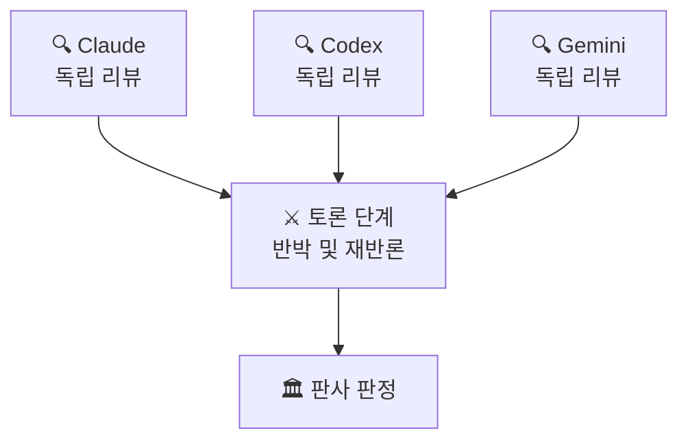
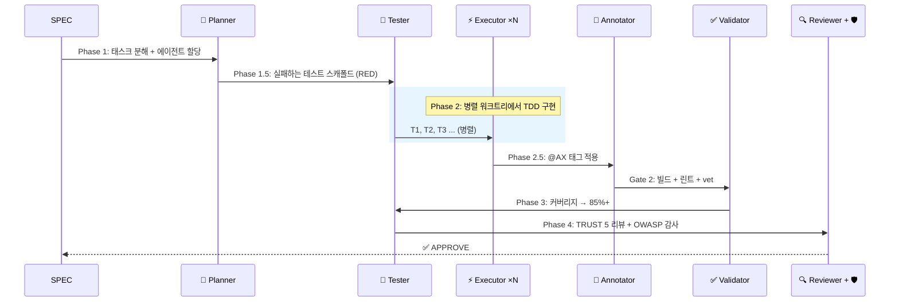
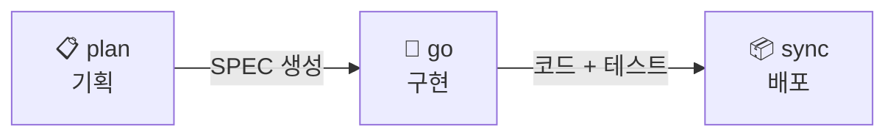

<div align="center">

# 🐙 Autopus-ADK

### AI 개발을 위한 운영 체제

**AI 에이전트가 자동완성만 하는 시대는 끝났습니다 — 기획하고, 토론하고, 구현하고, 테스트하고, 리뷰하고, 배포합니다.**

[](https://github.com/Insajin/autopus-adk/stargazers)
[](https://opensource.org/licenses/MIT)
[](https://golang.org)
[](#-하나의-설정-다섯-개-플랫폼)
[](#-15개-전문-에이전트)
[](#-전체-명령어)

[빠른 시작](#-30초-설치) · [왜 Autopus인가](#-문제점) · [**핵심 워크플로우**](#-워크플로우-세-개의-명령으로-배포까지) · [주요 기능](#-autopus가-다른-이유) · [파이프라인](#-파이프라인) · [명령어](#-전체-명령어)

[🇺🇸 English](../README.md)

</div>

---

## 🎬 실제 동작

<p align="center"></p>

```bash
# 원하는 것을 설명하세요.
/auto plan "Google과 GitHub 프로바이더로 OAuth2 인증 추가"

# 15개 에이전트가 나머지를 처리합니다 — 기획, 테스트, 구현, 리뷰.
/auto go SPEC-AUTH-001 --auto --loop

# 문서, 변경 이력, SPEC 상태 — 한 명령으로 동기화.
/auto sync SPEC-AUTH-001
```

```
🐙 Pipeline ─────────────────────────────────────────────
  ✓ Phase 1:   Planning         planner가 5개 태스크 분해
  ✓ Phase 1.5: Test Scaffold    12개 실패 테스트 생성 (RED)
  ✓ Phase 2:   Implementation   3개 executor가 병렬 워크트리에서 구현
  ✓ Phase 2.5: Annotation       8개 파일에 @AX 태그 적용
  ✓ Phase 3:   Testing          커버리지: 62% → 91%
  ✓ Phase 4:   Review           TRUST 5: APPROVE | 보안: PASS
  ───────────────────────────────────────────────────────
  ✅ 5/5 태스크 │ 91% 커버리지 │ 보안 이슈 0건 │ 4분 32초
```

> 💡 슬래시 명령 하나로. 테스트, 보안 감사, 문서, 의사결정 이력이 포함된 프로덕션 수준의 코드.

---

## 😤 문제점

AI 코딩 도구를 사용하고 계시죠. 강력합니다. 하지만...

- 🔄 **플랫폼 종속** — Claude에서 Codex로 바꾸려면? 모든 규칙과 프롬프트를 처음부터 다시 작성.
- 🎲 **희망 주도 개발** — "인증 추가해줘" → AI가 코드를 쓰고, 테스트를 건너뛰고, 보안을 무시하고, 문서를 잊음. *아마* 동작할 수도.
- 🧠 **건망증** — 다음 세션에서 AI는 모든 결정을 잊음. "왜 이 패턴을 썼지?" → 침묵.
- 👤 **솔로 에이전트** — 하나의 모델, 하나의 컨텍스트, 한 번의 기회. 다중 파일 리팩토링? 행운을 빕니다.

---

## 🔥 Autopus가 다른 이유

### 🤖 챗봇이 아닌, 팀을 구성하는 AI 에이전트

Autopus는 하나의 AI 어시스턴트가 아닌 — 역할 정의, 품질 게이트, 재시도 로직을 갖춘 **15개 전문 에이전트 소프트웨어 엔지니어링 팀**을 제공합니다.

```
🧠 Planner        →  요구사항을 태스크로 분해
⚡ Executor ×N    →  병렬 워크트리에서 코드 구현
🧪 Tester         →  코드 작성 전에 테스트 먼저 (TDD 강제)
✅ Validator       →  빌드, 린트, vet 검사
🔍 Reviewer       →  TRUST 5 코드 리뷰
🛡️ Security       →  OWASP Top 10 보안 감사
📝 Annotator      →  @AX 태그로 코드 문서화
🏗️ Architect      →  시스템 설계 결정
... 외 7개
```

### ⚔️ AI 모델들이 서로 토론한다

하나의 모델이 코드를 리뷰하는 게 아닙니다 — **여러 모델이 서로의 발견에 대해 논쟁합니다.**

```bash
auto orchestra review --strategy debate
```

Claude, Codex, Gemini가 독립적으로 코드를 리뷰한 후, 구조화된 2단계 토론에서 **서로의 발견에 반박합니다.** 판사가 최종 판정을 내립니다.



4가지 전략: **Consensus** · **Debate** · **Pipeline** · **Fastest**

### 🔁 자가 치유 파이프라인 (RALF 루프)

품질 게이트는 실패만 하지 않습니다 — **스스로 고치고 재시도합니다.**

```bash
/auto go SPEC-AUTH-001 --auto --loop
```

```
🐙 RALF [Gate 2] ──────────────────
  Iteration: 1/5 │ Issues: 3
  → golangci-lint 경고 수정을 위해 executor 스폰 중...

🐙 RALF [Gate 2] ──────────────────
  Iteration: 2/5 │ Issues: 3 → 0
  Status: PASS ✅
```

**RALF = RED → GREEN → REFACTOR → LOOP** — TDD 원칙을 파이프라인 자체에 적용. 내장 서킷 브레이커가 무한 루프를 방지합니다.

### 🌳 격리된 워크트리에서 병렬 에이전트 실행

여러 executor가 **동시에** 작업합니다 — 각각 자체 git 워크트리에서. 충돌 없음. 손상 없음.

```
Phase 2: Implementation
  ├── ⚡ Executor 1 (worktree/T1) → pkg/auth/provider.go     ✓
  ├── ⚡ Executor 2 (worktree/T2) → pkg/auth/handler.go      ✓
  └── ⚡ Executor 3 (worktree/T3) → pkg/auth/middleware.go    ✓

Phase 2.1: Merge (태스크 ID 순서)
  ✓ T1 병합 → T2 병합 → T3 병합 → 작업 브랜치
```

파일 소유권으로 충돌 방지. GC 억제로 손상 방지. 최대 **5개 동시 워크트리.**

### 📜 Lore: 코드베이스는 절대 잊지 않는다

모든 커밋이 what이 아닌 **why**를 기록합니다. 영원히 조회 가능.

```
feat(auth): OAuth2 프로바이더 추상화 추가

Why: Google + GitHub 지원이 필요하고, 향후 프로바이더 확장 가능해야 함
Decision: 직접 SDK 사용 대신 인터페이스 기반 추상화
Alternatives: 직접 SDK 호출 (거부: 결합도 높음)
Ref: SPEC-AUTH-001

🐙 Autopus <noreply@autopus.co>
```

9개 구조화된 트레일러. `auto lore query "왜 인터페이스?"`로 조회. 90일 지난 결정은 자동 감지.

### 🧪 자율 실험 루프

AI가 자율적으로 반복합니다 — 측정하고, 유지 또는 폐기하고, 반복합니다.

```bash
/auto experiment --metric "go test -bench=BenchmarkProcess" --direction lower --max-iter 5
```

```
🐙 Experiment ───────────────────────
  Iter 1: baseline  │ 1200 ns/op
  Iter 2: optimize  │  850 ns/op  ✓ keep (29% improvement)
  Iter 3: refactor  │  900 ns/op  ✗ discard (regression)
  Iter 4: cache     │  620 ns/op  ✓ keep (27% improvement)
  ─────────────────────────────────────
  Result: 1200 → 620 ns/op (48% improvement)
```

내장 **서킷 브레이커**로 무한 반복을 방지합니다. **단순성 점수**가 과도하게 복잡한 솔루션에 패널티를 부여합니다. 각 반복은 git 커밋으로 기록되어 리뷰 및 롤백이 용이합니다.

### 🌐 하나의 설정, 다섯 개 플랫폼

```bash
auto init   # 설치된 모든 AI 코딩 CLI 자동 감지
```

하나의 `autopus.yaml`이 감지된 모든 플랫폼에 **네이티브 설정**을 생성합니다.

| 플랫폼 | 생성되는 파일 |
|--------|-------------|
| **Claude Code** | `.claude/rules/`, `.claude/skills/`, `.claude/agents/`, `CLAUDE.md` |
| **Codex** | `.codex/`, `AGENTS.md` |
| **Gemini CLI** | `.gemini/`, `GEMINI.md` |
| **Cursor** | `.cursor/rules/`, `.cursorrules` |
| **OpenCode** | `.opencode/`, `agents.json` |

동일한 15개 에이전트. 동일한 37개 스킬. 동일한 규칙. **어디서나.**

---

## 📦 30초 설치

```bash
curl -sSfL https://raw.githubusercontent.com/Insajin/autopus-adk/main/install.sh | sh
```

<details>
<summary>기타 설치 방법</summary>

```bash
# Homebrew (준비 중)
# brew install insajin/autopus/auto

# go install (Go 1.26+ 필요)
go install github.com/Insajin/autopus-adk/cmd/auto@latest

# 소스에서 빌드
git clone https://github.com/Insajin/autopus-adk.git
cd autopus-adk && make build && make install
```

</details>

그런 다음, 아무 프로젝트에서:

```bash
auto init       # 플랫폼 감지, 하네스 생성
auto setup      # 프로젝트 컨텍스트 문서 생성
```

---

## 🤖 파이프라인

### 7단계 멀티 에이전트 파이프라인

모든 `/auto go`가 이 파이프라인을 실행합니다:



### 15개 전문 에이전트

| 에이전트 | 역할 | 실행 시점 |
|---------|------|----------|
| **Planner** | SPEC 분해, 태스크 할당, 복잡도 평가 | Phase 1 |
| **Spec Writer** | spec.md, plan.md, acceptance.md, research.md 생성 | `/auto plan` |
| **Tester** | 테스트 스캐폴드 (RED) + 커버리지 부스트 (GREEN) | Phase 1.5, 3 |
| **Executor** | 병렬 워크트리에서 TDD 구현 | Phase 2 |
| **Annotator** | @AX 태그 라이프사이클 관리 | Phase 2.5 |
| **Validator** | 빌드, vet, 린트, 파일 크기 검사 | Gate 2 |
| **Reviewer** | TRUST 5 코드 리뷰 | Phase 4 |
| **Security Auditor** | OWASP Top 10 취약점 스캔 | Phase 4 |
| **Architect** | 시스템 설계, 아키텍처 결정 | 온디맨드 |
| **Debugger** | 재현 우선 버그 수정 | `/auto fix` |
| **DevOps** | CI/CD, Docker, 인프라 | 온디맨드 |
| **Frontend Specialist** | Playwright E2E + VLM 시각적 회귀 감지 | Phase 3.5 |
| **UX Validator** | 프론트엔드 컴포넌트 시각적 검증 | Phase 3.5 |
| **Perf Engineer** | 벤치마크, pprof, 성능 회귀 감지 | 온디맨드 |
| **Explorer** | 코드베이스 구조 분석 | `/auto map` |

### 품질 모드

```bash
/auto go SPEC-ID --quality ultra      # 모든 에이전트를 Opus로 — 최고 품질
/auto go SPEC-ID --quality balanced   # 적응형: 태스크 복잡도별 Opus/Sonnet/Haiku
```

| 모드 | Planner | Executor | Validator | 비용 |
|------|---------|----------|-----------|------|
| **Ultra** | Opus | Opus | Opus | $$$ |
| **Balanced** | Opus | 적응형* | Haiku | $ |

\* HIGH 복잡도 → Opus · MEDIUM → Sonnet · LOW → Haiku

### 실행 모드

| 플래그 | 모드 | 설명 |
|--------|------|------|
| *(기본)* | 서브에이전트 파이프라인 | 메인 세션이 Agent() 호출 오케스트레이션 |
| `--team` | Agent Teams | Lead / Builder / Guardian 역할 기반 팀 |
| `--solo` | 단일 세션 | 서브에이전트 없이 직접 TDD |
| `--auto --loop` | 완전 자율 | RALF 자가 치유, 사용자 승인 없음 |
| `--multi` | 멀티 프로바이더 | 여러 모델로 토론/합의 리뷰 |

---

## 📐 워크플로우: 세 개의 명령으로 배포까지

Autopus의 모든 기능은 동일한 **plan → go → sync** 라이프사이클을 따릅니다. 예외 없음.



### 📋 1단계 · `/auto plan` — 원하는 것을 설명하세요

자연어 설명을 완전한 **SPEC**으로 변환합니다 — 요구사항, 태스크, 수락 기준, 리스크 분석까지.

```bash
/auto plan "재시도와 데드 레터 큐를 갖춘 웹훅 전송 추가"
```

spec-writer 에이전트가 5개 문서를 생성합니다:

```
.autopus/specs/SPEC-HOOK-001/
├── prd.md          # 제품 요구사항 문서
├── spec.md         # EARS 형식 요구사항
├── plan.md         # 태스크 분해 + 에이전트 할당
├── acceptance.md   # Given-When-Then 수락 기준
└── research.md     # 기술 조사 + 리스크
```

옵션: `--multi` 멀티 프로바이더 리뷰 · `--prd-mode minimal` 경량 PRD · `--skip-prd` PRD 건너뛰고 바로 SPEC

### 🚀 2단계 · `/auto go` — 구현하기

SPEC을 **15개 에이전트**에 전달합니다. 기획, 테스트 스캐폴드, 병렬 구현, 검증, 어노테이션, 테스트, 리뷰까지 — 모두 자동으로.

```bash
/auto go SPEC-HOOK-001 --auto --loop
```

```
Phase 1    │ 🧠 Planner         │ SPEC → 태스크 + 에이전트 할당
Phase 1.5  │ 🧪 Tester          │ 실패하는 테스트 스켈레톤 (RED)
Phase 2    │ ⚡ Executor ×N      │ 병렬 워크트리에서 TDD
Phase 2.5  │ 📝 Annotator       │ @AX 문서화 태그
Gate  2    │ ✅ Validator        │ 빌드 + 린트 + vet
Phase 3    │ 🧪 Tester          │ 커버리지 → 85%+
Phase 4    │ 🔍 Reviewer + 🛡️    │ TRUST 5 + OWASP 감사
```

옵션: `--team` Agent Teams · `--solo` 단일 세션 TDD · `--quality ultra` 전체 Opus 실행 · `--multi` 멀티 모델 리뷰

### 📦 3단계 · `/auto sync` — 배포하고 문서화하기

SPEC 상태 업데이트, 프로젝트 문서 재생성, @AX 태그 라이프사이클 관리, 구조화된 Lore 이력으로 커밋.

```bash
/auto sync SPEC-HOOK-001
```

```
╭────────────────────────────────────╮
│ 🐙 파이프라인 완료!                 │
│ SPEC-HOOK-001: 웹훅 전송           │
│ 태스크: 5/5 │ 커버리지: 91%         │
│ 리뷰: APPROVE                      │
╰────────────────────────────────────╯
```

**끝입니다.** 세 개의 명령: 기획 → 구현 → 배포. 모든 결정이 기록됩니다. 모든 테스트가 강제됩니다.

---

## 🎯 TRUST 5 코드 리뷰

모든 리뷰는 5개 차원으로 평가됩니다:

| | 차원 | 검사 항목 |
|---|------|----------|
| **T** | Tested (테스트) | 85%+ 커버리지, 엣지 케이스, `go test -race` |
| **R** | Readable (가독성) | 명확한 네이밍, 단일 책임, ≤ 300 LOC |
| **U** | Unified (일관성) | gofmt, goimports, golangci-lint, 일관된 패턴 |
| **S** | Secured (보안) | OWASP Top 10, 인젝션 없음, 하드코딩된 시크릿 없음 |
| **T** | Trackable (추적성) | 의미 있는 로그, 에러 컨텍스트, SPEC/Lore 참조 |

---

## 📊 멀티 모델 오케스트레이션

| 전략 | 작동 방식 | 적합한 용도 |
|------|----------|------------|
| **🤝 Consensus** | 독립 응답을 키 합의로 병합 | 기획, 코드 리뷰 |
| **⚔️ Debate** | 2단계 토론 + 판사 판정 | 중요 결정, 보안 |
| **🔗 Pipeline** | N번째 출력 → N+1번째 입력 | 반복 정제 |
| **⚡ Fastest** | 가장 먼저 완료된 응답 사용 | 빠른 질문 |

프로바이더: **Claude** · **Codex** · **Gemini** — 그레이스풀 디그레이드 지원.

---

## 📖 전체 명령어

<details>
<summary><strong>CLI 명령어</strong> (루트 21개, 서브커맨드 포함 55개+)</summary>

| 명령어 | 설명 |
|--------|------|
| `auto init` | 하네스 초기화 — 플랫폼 감지, 파일 생성 |
| `auto update` | 하네스 업데이트 (마커 기반, 사용자 편집 보존) |
| `auto doctor` | 상태 진단 |
| `auto platform` | 플랫폼 관리 (list / add / remove) |
| `auto arch` | 아키텍처 분석 (generate / lint) |
| `auto spec` | SPEC 관리 (new / validate / review) |
| `auto lore` | 의사결정 추적 (context / commit / validate / stale) |
| `auto orchestra` | 멀티 모델 오케스트레이션 (review / plan / secure / brainstorm) |
| `auto setup` | 프로젝트 컨텍스트 문서 (generate / update / validate) |
| `auto status` | SPEC 대시보드 (done / in-progress / draft) |
| `auto telemetry` | 파이프라인 텔레메트리 (record / summary / cost / compare) |
| `auto skill` | 스킬 관리 (list / info) |
| `auto search` | 지식 검색 (Exa) |
| `auto docs` | 라이브러리 문서 조회 (Context7) |
| `auto lsp` | LSP 연동 (diagnostics / refs / rename / symbols) |
| `auto verify` | 프론트엔드 UX 검증 (Playwright + VLM) |
| `auto check` | 하네스 규칙 검사 (안티패턴 스캔) |
| `auto hash` | 파일 해싱 (xxhash) |
| `auto issue` | 자동 이슈 리포터 (에러 컨텍스트 수집, GitHub 제출) |
| `auto experiment` | 자율 실험 루프 (메트릭 기반 유지/폐기) |

</details>

<details>
<summary><strong>슬래시 명령어</strong> (AI 코딩 CLI 내부)</summary>

| 명령어 | 설명 |
|--------|------|
| `/auto plan "설명"` | 새 기능의 SPEC 작성 |
| `/auto go SPEC-ID` | 전체 파이프라인으로 구현 |
| `/auto go SPEC-ID --auto --loop` | 완전 자율 + 자가 치유 |
| `/auto go SPEC-ID --team` | Agent Teams (Lead/Builder/Guardian) |
| `/auto go SPEC-ID --multi` | 멀티 프로바이더 오케스트레이션 |
| `/auto fix "버그"` | 재현 우선 버그 수정 |
| `/auto review` | TRUST 5 코드 리뷰 |
| `/auto secure` | OWASP Top 10 보안 감사 |
| `/auto map` | 코드베이스 구조 분석 |
| `/auto sync SPEC-ID` | 구현 후 문서 동기화 |
| `/auto dev "설명"` | 원샷: plan → go → sync |
| `/auto setup` | 프로젝트 컨텍스트 문서 생성/업데이트 |
| `/auto stale` | 오래된 결정 및 패턴 감지 |
| `/auto why "질문"` | 의사결정 근거 조회 |
| `/auto experiment` | 자율 실험 루프 (메트릭 기반 반복) |

</details>

---

## ⚙️ 설정

<details>
<summary><strong><code>autopus.yaml</code></strong> — 모든 것을 위한 단일 설정</summary>

```yaml
mode: full                    # full 또는 lite
project_name: my-project
platforms:
  - claude-code

architecture:
  auto_generate: true
  enforce: true

lore:
  enabled: true
  required_trailers: [Why, Decision]
  stale_threshold_days: 90

spec:
  review_gate:
    enabled: true
    strategy: debate
    providers: [claude, gemini]
    judge: claude

methodology:
  mode: tdd
  enforce: true

orchestra:
  enabled: true
  default_strategy: consensus
  providers:
    claude:
      binary: claude
    codex:
      binary: codex
    gemini:
      binary: gemini
```

</details>

---

## 🏗️ 아키텍처

```
autopus-adk/
├── cmd/auto/           # 진입점
├── internal/cli/       # Cobra 명령어 21개 (서브커맨드 포함 55개+)
├── pkg/
│   ├── adapter/        # 플랫폼 어댑터 5개 (Claude, Codex, Gemini, Cursor, OpenCode)
│   ├── orchestra/      # 멀티 모델 오케스트레이션 (전략 4개 + brainstorm)
│   ├── spec/           # SPEC 엔진 (EARS 형식)
│   ├── lore/           # 의사결정 추적 (9-trailer 프로토콜)
│   ├── content/        # 에이전트/스킬/훅 생성 + 스킬 활성화
│   ├── arch/           # 아키텍처 분석 + 규칙 강제
│   ├── sigmap/         # go/ast API 시그니처 추출
│   ├── constraint/     # 안티패턴 스캔
│   ├── telemetry/      # 파이프라인 텔레메트리 + 비용 추정
│   ├── cost/           # 토큰 기반 비용 추정
│   ├── setup/          # 프로젝트 문서 생성
│   ├── lsp/            # LSP 연동
│   ├── search/         # 지식 검색 (Context7/Exa)
│   ├── issue/          # 자동 이슈 리포터 (컨텍스트 수집, 정제)
│   ├── experiment/     # 자율 실험 루프 (메트릭 실행, 서킷 브레이커)
│   └── ...             # template, detect, config, version
├── templates/          # 플랫폼별 템플릿
├── content/            # 임베디드 콘텐츠 (15개 에이전트, 37개 스킬)
└── configs/            # 기본 설정
```

---

## 🤝 기여하기

Autopus-ADK는 MIT 라이선스의 오픈 소스입니다. PR 환영합니다!

```bash
make test       # 레이스 디텍션 테스트 실행
make lint       # go vet 실행
make coverage   # 커버리지 리포트 생성
```

---

<div align="center">

**🐙 Autopus** — AI 에이전트는 챗봇이 아닌, 팀이 되어야 합니다.

</div>
